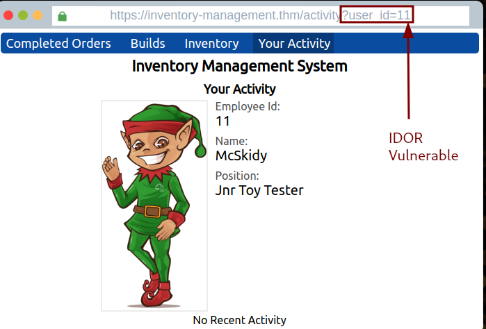
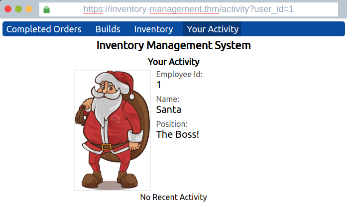
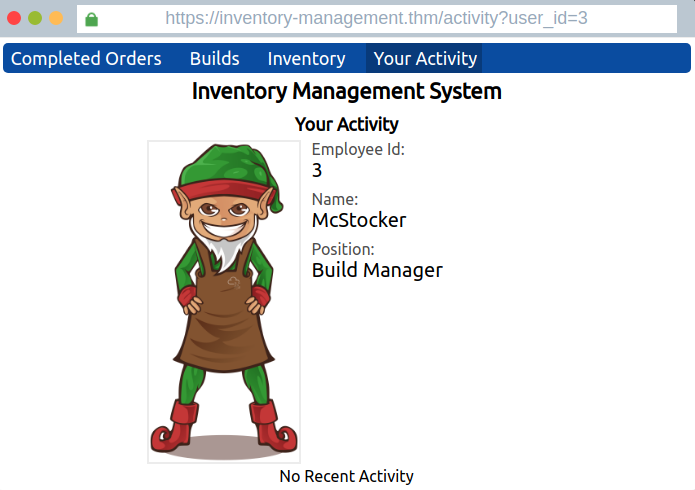
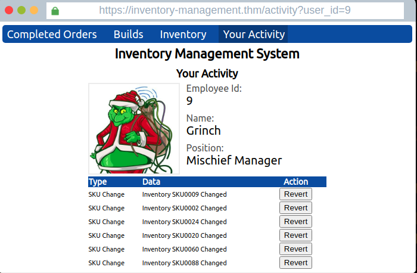
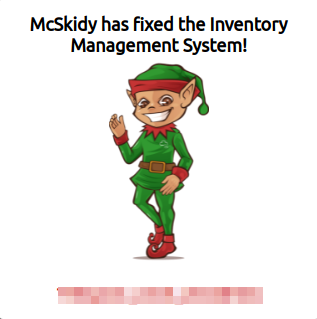

# TryHackMe - Advent of Cyber 2021 - Day 1
## Save the Gifts (Web-Exploitation)
> Edward Hartmann
> December 19, 2021

***<u>Refs/Links:</u>***
- [Advent of Cyber 2021 TOC](Advent%20of%20Cyber%20Table%20of%20Contents.md)  
-  Tags[^1] 
-  Flag[^2]

[^1]: #idor #webapp 
[^2]: *Question 1:* `The Boss!`  
					*Question 2:* `Build Manager`
					*Question 3:* `Mischief Manager`  
					*Question 4:* `THM{AOC_IDOR_2B34BHI3}`  

## Walkthrough
We are given an [IDOR](../../../../Knowledge%20Base/Vulnerabilities/Insecure%20Direct%20Object%20Reference%20(IDOR).md) vulnerable website. Navigating to the *Your Activity* page shows a vulnerable URL. 



Logical User ID for admin, superuser, or other desirable accounts is `1` or `0` and an attempt yields the activity for "Santa" is `1`.



Attempting several others yields User ID  `3` is for "McStocker and `9` is for "The Grinch." There are several options for *Revert* on the page related to changed inventory SKU numbers. 



```
https://inventory-management.thm/activity?user_id=9
```



Reverting all of the changes yielded the [flag](AoC_2021_Day01.md#Flag%20THM%20AOC_IDOR_2B34BHI3) for the box.  Scroll down for flag



***Congratulations on completing this box!***  

See you at the next one &mdash; [Advent of Cyber 3 Day 2](Day%2002%20%20-%20Advent%20of%20Cyber%202021.md)
</br>
</br>
</br>
</br>
</br>
</br>
</br>
</br>
</br>
</br>
</br>
</br>
</br>
</br>
</br>
</br>
</br>
</br>
</br>
</br>
</br>
</br>
</br>
</br>
</br>
</br>
</br>
</br>
</br>
</br>
</br>
</br>
</br>
</br>
</br>
</br>
</br>
</br>
</br>
</br>
</br>
</br>
</br>
</br>
</br>
</br>
</br>
</br>
</br>
</br>
</br>
</br>
</br>
</br>
</br>
</br>
</br>
</br>
</br>
</br>
</br>
</br>
</br>


