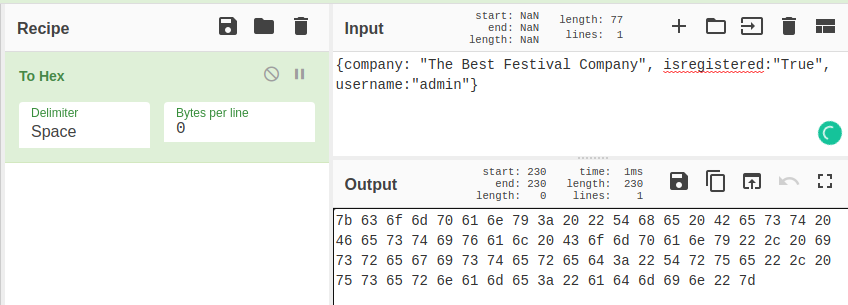

# TryHackMe - Advent of Cyber 2021 - Day 2
## Elf HR Problems (Web-Exploitation)
> Edward Hartmann
> December 20, 2021

<u>Refs/Links:</u>
- [Advent of Cyber 2021 TOC](Advent%20of%20Cyber%20Table%20of%20Contents.md)  
-  Tags[^1]


[^1]: #cookies #authentication #webapp #encoding #hexe
[^2]: *Question 1:* `user-auth`  
					*Question 2:* `hexadecimal`
					*Question 3:* `JSON`  
					*Question 4:* `7b636f6d70616e793a2022546865204265737420466573746976616c20436f6d70616e79222c206973726567697374657265643a2254727565222c20757365726e616d653a2261646d696e227d` 
					*Question 5:* `HR`  
					*Question 6:* `Application`  

## Walkthrough
We are given a website and told it is vulnerable to [cookie manipulation](../../../../Knowledge%20Base/Vulnerabilities/Cookie%20Manipulation.md). 


With no initial access to the website, we are going to create an account. Before we do this, will inspect the [Cookies](../../../../Knowledge%20Base/Concepts/Web/Cookies.md) to see what changes when we do. No cookies are present before creating an account or logging in. 


When attempting to create an account, we are told we do not have the permissions to do so. 


While we could not create an account, we were given a cookie named `user-auth` with a value `7b636f6d70616e793a2022546865204265737420466573746976616c20436f6d70616e79222c206973726567697374657265643a2254727565222c20757365726e616d653a226e305f77617265227d`.

![User-Auth Cookie]](AoC-2021_Photos/Day_2/4.0_AoC-Day-2_12-20-21-User-Auth-Cookie.png)

To identify this cookies [encoding](../../../../Knowledge%20Base/Concepts/General/Encoding%20and%20Decoding.md) we will use [CyberChef](https://gchq.github.io/CyberChef/) on GitHub. Paste the cookie into the `Input` box and drag `Magic` from the left menu into the `Recipe` pane. The output field informs us this encoded with `hexadecimal`. This can be verified by removing `Magic` and replacing it with `From Hex` to achieve the same result. 


Verified with `From Hex`


At a glance, it is also easy to note that this is `hexadecimal` due to the type of values in the string. It is entirely alphanumeric, and there are no characters except `a-f`. 

Our decoded value is in JSON format, an easily editable type of object we can modify to our needs. The cookie also contains little identifiable information to prevent us from using another username to attempt to log in. Let's give it a try with the username `admin`. Using *CyberChef*, simply replace `From Hex` with `To Hex` and put the modified `JSON` in the `Input` field. 



With the new `JSON` cookie encoded back to *hex*, it is time to action the cookie in the vulnerable website. 

Back in the Developer tab of the website, replace the current cookie with the new one and refresh the page. After some trial and error, removing the spaces in the new *hex* code worked. 

The spaces can be removed using [sed](../../../../Tools,%20Binaries,%20and%20Programs/CLI%20Utilities/sed.md). 

```
echo "7b 63 6f 6d 70 61 6e 79 3a 20 22 54 68 65 20 42 65 73 74 20 46 65 73 74 69 76 61 6c 20 43 6f 6d 70 61 6e 79 22 2c 20 69 73 72 65 67 69 73 74 65 72 65 64 3a 22 54 72 75 65 22 2c 20 75 73 65 72 6e 61 6d 65 3a 22 61 64 6d 69 6e 22 7d" > cookie.txt     

cat cookie.txt                                          
7b 63 6f 6d 70 61 6e 79 3a 20 22 54 68 65 20 42 65 73 74 20 46 65 73 74 69 76 61 6c 20 43 6f 6d 70 61 6e 79 22 2c 20 69 73 72 65 67 69 73 74 65 72 65 64 3a 22 54 72 75 65 22 2c 20 75 73 65 72 6e 61 6d 65 3a 22 61 64 6d 69 6e 22 7d

cat cookie.txt | sed -r 's/\s+//g' > modified_cookie.txt

cat modified_cookie.txt                                 
7b636f6d70616e793a2022546865204265737420466573746976616c20436f6d70616e79222c206973726567697374657265643a2254727565222c20757365726e616d653a2261646d696e227d
```

_Formatted Admin Cookie_
```
7b636f6d70616e793a2022546865204265737420466573746976616c20436f6d70616e79222c206973726567697374657265643a2254727565222c20757365726e616d653a2261646d696e227d
```


From the dashboard, it is clear the *HR* team is not responding for at least has not for 7 hours. It is also clear there is a network warning on the *Application* team.

***Congratulations on completing this box!***  

See you at the next one &mdash; [Advent of Cyber 3 Day 3](Day%2003%20%20-%20Advent%20of%20Cyber%202021.md)
</br>
</br>
</br>
</br>
</br>
</br>
</br>
</br>
</br>
</br>
</br>
</br>
</br>
</br>
</br>
</br>
</br>
</br>
</br>
</br>
</br>
</br>
</br>
</br>
</br>
</br>
</br>
</br>
</br>
</br>
</br>
</br>
</br>
</br>
</br>
</br>
</br>
</br>
</br>
</br>
</br>
</br>
</br>
</br>
</br>
</br>
</br>
</br>
</br>
</br>
</br>
</br>
</br>
</br>
</br>
</br>
</br>
</br>
</br>
</br>
</br>
</br>
</br>
