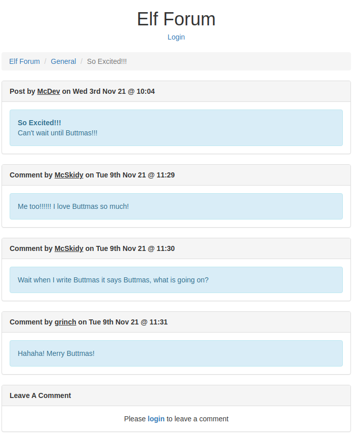
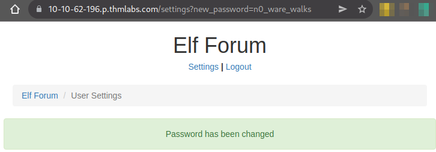
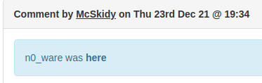
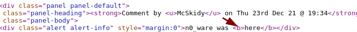
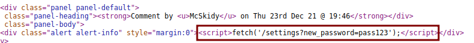
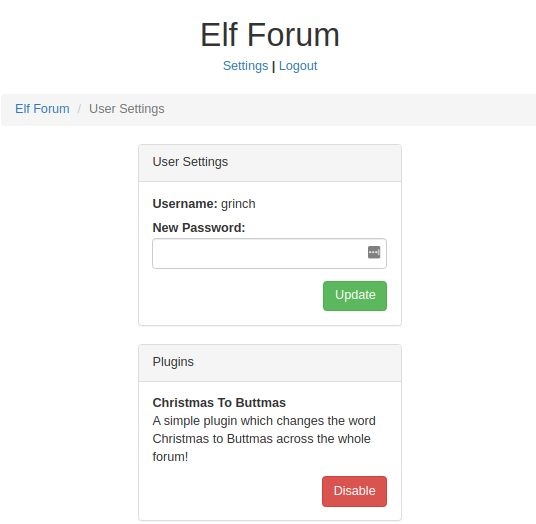

# TryHackMe - Advent of Cyber 2021 - Day 5
## Pesky Elf Forum (Web-Exploitation)
> Edward Hartmann
> December 23, 2021

***<u>Refs/Links:</u>***
- [Advent of Cyber 2021 TOC](Advent%20of%20Cyber%20Table%20of%20Contents.md)  
-  Tags[^1]
-  Flag[^2]

[^1]: #xss #webapp #injection #owasp #storedxss 
[^2]: *Flag 1:* `THM{NO_MORE_BUTTMAS}`  

## Walkthrough
In this lab, we are given a URL for a forum vulnerable to [Cross-Site Scripting](../../../../Knowledge%20Base/Vulnerabilities/Cross-Site%20Scripting%20(XSS).md). Head to the URL provided in the lab to view the forum. Explore different topics, threads, links, etc. The first thing we are told to note is that every mention of *Christmas* has been changed to *Buttmas*. Clever Grinch... We need access to the Grinch's account to disable whatever is causing the change. 

Fortunately, McSkidy has access to the forum with the credentials `McSkidy:password`...he needs to work on his password habits. Login to the web page with the link near the top. We now have access to the `Settings` panel for the forum. We are told to change our password to something else. Immediately, we can see that the new password is reflected in a query in the URL. A good sign that *XSS* is possible. 

`https://10-10-62-196.p.thmlabs.com/settings?new_password=n0_ware_walks`

Head to the forum and see if the comments section is also vulnerable by adding a comment with some `HTML` tags in the text. 

`n0_ware was <b>here</b>`

The comment successfully renders the tags, informing us that whatever processing the forum has, at the very least, does not strip out `HTML` code when submitting the data to the database. Here we have a guarantee of potential vulnerability to [**Reflected Cross-Site Scripting**](../../../../Knowledge%20Base/Vulnerabilities/Cross-Site%20Scripting%20(XSS).md)

You can also see this **stored** on the source code of the web page. 

So far, we have identified a URL on this page vulnerable to XSS, and have confirmed the comments page is vulnerable to *Stored* XSS. Let's combine the two by submitting a comment with a malicious script that calls the vulnerable URL in a script. When the web page renders this script, it will do so in the context of the user viewing the web page. The hope is that the Grinch (or any unsuspecting user) will view the comment and thus reset their password. 

Post the following comment. The `fetch` here tells the browser to make a network request to the specified URL.

``

The commend board won't render any text. View the source code of the web page to ensure the comment worked.

After waiting for a minute or two for Grinch to view our comment, attempt to login with their credentials `grinch:pass123`. Success! We have access to Grinch's account. On the settings page, we find the malicious plugin Grinch enabled. Disable it to solve the problem. 

***Congratulations on completing this box!***  

See you at the next one &mdash; [Advent of Cyber 3 Day 6](Day%2006%20-%20Advent%20of%20Cyber%202021.md)
 
 
 
 
 
 
 
 
 
 
 
 
 
 
 
 
 
 
 
 
 
 
 
 
 
 
 
 
 
 
 
 
 
 
 
 
 
 
 
 
 
 
 
 
 
 
 
 
 
 
 
 
 
 
 
 
 
 
 
 
 
 
 
