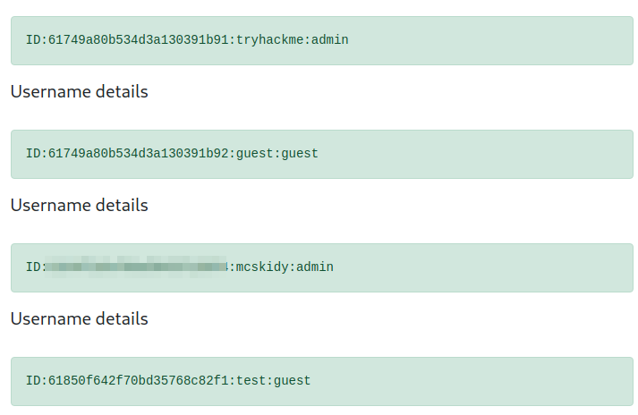

# TryHackMe - Advent of Cyber 2021 - Day 7
## Migration without Security (Web-Exploitation)
> Edward Hartmann
> December 27, 2021

***<u>Refs/Links:</u>***
- [Advent of Cyber 2021 TOC](Advent%20of%20Cyber%20Table%20of%20Contents.md)  
-  Tags[^1]
-  Flag[^2]

[^1]: #nosql #injection #webapp #database #burp 
[^2]: *Flag 1:* THM{8814a5e6662a9763f7df23ee59d944f9}   
					*Flag 2:* THM{b6b304f5d5834a4d089b570840b467a8}  
					*Flag 3:* THM{2ec099f2d602cc4968c5267970be1326}  
					*Flag 4:* ID:6184f516ef6da50433f100f4:mcskidy:admin  

## TOC
- [Question 1](#Question-1)
- [Question 2](#Question-2)
- [Question 3](#Question-3)
- [Question 4](#Question-4)

## Walkthrough

In this box are are going to be exploring [NoSQL Injection](../../../../Knowledge%20Base/Vulnerabilities/NoSQL%20Injection.md) via a **MongoDB** [NoSQL](../../../../Knowledge%20Base/Concepts/Databases/NoSQL.md) server. Begin by accessing the URL in your browser and starting an `nmap` against the server with the standard enumeration flags.


Nothing of note except for a secondary `ssh` service running on port `2222` and a `node.js` server running on port `8000` We know already that the secondary `ssh` is for practicing the beginning of the walkthrough. We may investigate the `node.js` server later. 

> I have altered my `/etc/hosts` file to set the IP equal to `aoc7.com`

### Question-1
[Top](#TOC)

First, we need to connect to the remote server via `ssh` on port `2222` with the credentials `thm : tryhackme`. 


Start an interactive session with the **MongoDB** server with `mongo` on the command line. The default port is `27017` and the command will use this unless otherwise specified. 

> The `mongo` command is being replaced with `mongosh` but this box is not configured for the new command. 

Once connected, we want to view the databases we have access to. Run `show databases`


As you can see, we have four &mdash; admin, config, flagdb, and local. Lets `use` the `flagdb` database, seems pretty obvious. From there, we can get the `Collection` names and find all values in that collection. The process from the beginning is simple:
- `show databases`
- `use flagdb`
- `db.getCollectionNames()`
- `db.flagColl.find()`

You will see the flag returned from the collection. 


### Question-2
###### [Top](#TOC)

For flag two, we need to gain access via the browser. The first thing we see is a login page. 


To bypass the login page via [Injection](../../../../Knowledge%20Base/Vulnerabilities/Injection.md), we are going to need a tool such as [BurpSuite](../../../../Tools,%20Binaries,%20and%20Programs/Information%20Gathering/Web%20Applications/BurpSuite.md) to iterate requests more easily, track responses, and take advantage of various utilities built in to the tool. Remember to turn on your proxy. 

To start, we'll send a test login request via a `POST` to the system and observe the response. Use any combination of `username:password`. Our attempt fails, and in the browser, you will see a simple message stating `{"msg":"Bad Creds"}`. What we have here is a *NoSQL* structured response in `JSON` notation. A better view of this comes from BurpSuite in the `Proxy > HTTP history` view.


Here we confirm some assumptions:
- The `403` error confirms we are unauthorized
- We see on line `8` of the `HTTP History` that were received `JSON` data. 
- The application accepted our `username` and `password` with those fields as names.
- We got `Bad Creds` in the `JSON` data back.

> Note that we **did not** see any vulnerable entry point in the URL. 

Let's try logging in as admin. Right-click the HTTP request we sent and choose `Send to repeater`. You'll find the `Repeater` utility in the top menu bar. If you are confident in your injection, you can simply try and modify an intercepted request.

> See the note on [BurpSuite](../../../../Tools,%20Binaries,%20and%20Programs/Information%20Gathering/Web%20Applications/BurpSuite.md) for additional information on `Repeater`

Here, we can quickly send requests using the same template requests but with small modifications, and view the history of those requests and the responses we received. For example, I changed the username to `admin` and received a similar message as before. 


Let's try some basic [NoSQL Injection](../../../../Knowledge%20Base/Vulnerabilities/NoSQL%20Injection.md) using common commands. Assuming there is an `admin` user, let's attempt to get the `password` field to evaluate to `true`. 

Unlike brute-force password attacks, we want to alter the `key` in the command, not just the `value`. In this case the two `keys` are `username` and `password`. The query the application is sending to the server probably looks something like 

```
# Browser
username=admin&password=password

# Backend
db.users.findOne({username:"admin", password:"password"})
```

If we want to alter the `password` field, we can do so in BurpSuite by adding  the `[$ne]` function right after `password`. See the example in the picture. 


This essentially turns the `POST` request into 

```
# Browser
username=admin&password[$ne]=password

# Backend
db.users.findOne({username:"admin", password:{"$ne":"password"}})
```

Send the modified request, and you'll see the response changes. We are given a `302 Found` response, indicating a redirect, and a new message body indicating we have access to the `/dashboard` page now. Looks like a success! 


Right-click this response, select `Request in browser > In original session`, copy the URL, and paste into the browser. You are now logged in as admin! Retrieve the first flag for your troubles. 


#### Using Intercept
Since know this method of injection worked, another way of accessing the page is to simply intercept the original login request, modify the intercepted request with the `[$ne]` function, and forward the request on. This will also give us admin access to the dashboard. 

### Question-3
[Top](#TOC)

> To accomplish question 2, you must have gotten browser access to the admin dashboard. See [Question-1](#Question-1) if you skipped over the steps that involved [BurpSuite](../../../../Tools,%20Binaries,%20and%20Programs/Information%20Gathering/Web%20Applications/BurpSuite.md) to gain access via the browser. 

For question three we are asked to enumerate the `gift search page` to list all usernames that have the `guest` role. On the request app with intercept running, send a test search query.


In this intercept, we can see a `GET` request looking for `username=testrequest` where `role=user`. Using our knowledge of [NoSQL Injection](../../../../Knowledge%20Base/Vulnerabilities/NoSQL%20Injection.md) commands, we can modify this to our needs. 

Since we want to return any user that matches the `guest` role, we need to tell the search query to return any user `not equal` to something, and change the `role` to `guest`. Simply add `[$ne]` directly after `username`, select a username you know doesn't exist, and change the role request. 


Easy as that! The webserver responded by providing results for **all** the usernames `not equal to n0_ware` that matched the role `guest`. 


### Question-4
[Top](#TOC)

For the final question, we want the `mcskidy` record returned. Immediately, we know that he is not associated with the `guest` role or he would have shown up in the last search. Trying to search for  `mcskidy` does not return anything. Looking at the image of our successful `guest` role query, it looks like we have three fields we can search for. 
- ID
- Username
- Role

First, let's change the `guest` field to `mcskidy` and use a `[$ne]` in front of username with a random user to see if that record is a role. Send another test request and intercept it so we can modify the `GET` request. 

`GET /search?username[$ne]=n0_ware&role=mcskidy HTTP/1.1`


That doesn't work, so let's see if there is an `ID` associated with `mcskidy`. Try this request

`GET /search?id=mcskidy&role[$ne]=guest HTTP/1.1`

That doesn't work either. Let's look for all the users. 

`GET /search?username[$ne]=n0_ware&role=user HTTP/1.1`

That returns a lot of users, but none of them are `mcskidy` Let's try this one more time, looking for all the usernames `not equal to` some random username that have a role `not qual to user`.

`GET /search?username[$ne]=n0_ware&role[$ne]=user HTTP/1.1`

Bingo! `mcskidy` has a role of `admin` and the username `mcskidy`. Paste this entire record in for your flag. 



***Congratulations on completing this box!***   Consider trying out some of the other commands such as `$exists` with a value of `true` for the field and `$regex` with a value of `.*` to match "anything that is there" and see what else you can get. 

See you at the next one &mdash; [Advent of Cyber 3 Day 8](Day%2008%20-%20Advent%20of%20Cyber%202021.md)
</br>
</br>
</br>
</br>
</br>
</br>
</br>
</br>
</br>
</br>
</br>
</br>
</br>
</br>
</br>
</br>
</br>
</br>
</br>
</br>
</br>
</br>
</br>
</br>
</br>
</br>
</br>
</br>
</br>
</br>
</br>
</br>
</br>
</br>
</br>
</br>
</br>
</br>
</br>
</br>
</br>
</br>
</br>
</br>
</br>
</br>
</br>
</br>
</br>
</br>
</br>
</br>
</br>
</br>
</br>
</br>
</br>
</br>
</br>
</br>
</br>
</br>
</br>
