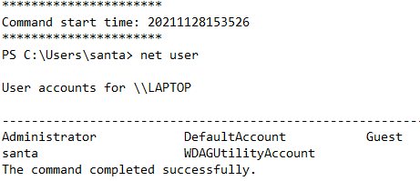

# TryHackMe - Advent of Cyber 2021 - Day 8
## Santa's Bag of Toys (Special by John Hammond)
> Edward Hartmann
> DATE

***<u>Refs/Links:</u>***
- [Advent of Cyber 2021 TOC](Advent%20of%20Cyber%20Table%20of%20Contents.md)  
-  Tags[^1]
-  Flag[^2]

[^1]: #powershell #windows #logs #lolbas #shellbags #ir
[^2]: *Flag 1:* `Microsoft Windows 11 Pro`  
					*Flag 2:* `grinchstolechristmas`  
					*Flag 3:* `C:\Users\santa\AppData\Local\Microsoft\Windows\UsrClass.dat`  
					*Flag 4:* `certutil.exe`  
					*Flag 5:* `.github`  
					*Flag 6:* `bag_of_toys.zip`  
					*Flag 7:* `Grinchiest` 
					*Flag 8:* `operation-bag-of-toys`  
					*Flag 9:* `uharc-cmd-install.exe`  
					*Flag 10:* `GRINCHMAS`
					*Flag 11:* `TheGrinchiestGrinchmasOfAll`
					
## TOC
- [Question 1](#Question-1)
- [Question 2](#Question-2)
- [Question 3](#Question-3)
- [Question 4](#Question-4)
- [Questions 5-6](#Questions-5-6)
- [Question 7](#Question-7)
- [Question 8](#Question-8)
- [Question 9](#Question-9)
- [Question 10](#Question-10)
- [Question 11](#Question-11)
- [Question 12](#Question-12)
## Walkthrough

In this scenario, Santa's laptop has gone missing, and all we have access to are some [PowerShell](../../../../Tools,%20Binaries,%20and%20Programs/Windows/PowerShell.md) transcription logs and an analysis machine. 

> Either start the attack box or login via your own VM through `RDP` using `xfreerdp` &mdash; `xfreerdp /u:Administrator /p:grinch123! /v:YOUR_IP_HERE`

### Question-1
[Top](#TOC)
 
Our first task is to identify the `OS Name` of Santa's laptop. This is the operating system. The first (earliest log file contains the answer &mdash; `PowerShell_transcript.LAPTOP._s3k_jad.20211128153510`. Someone ran the  `systeminfo` command on this PC. 

### Question-2
[Top](#TOC)
 
The second question asks us about the password set for a "backdoor" account and we are asked to parse through the logs to search for some suspicious activity. There are some indicators of questionable behavior via some of the commands run in the logs. 

In the same log file as question 1, we see someone enumerated the user accounts on the laptop via the `net user` command. 

In the log, named `PowerShell_transcript.LAPTOP.k_dg27us.20211128153538`, we see the creation of a user account named `s4nta` with a long password, and that someone added this user as an `administrator`. 

If you scroll down further, you can see the actor confirmed this via the `wmic` command to check the `sid` or `security group identifier` field. 

### Question-3
[Top](#TOC)
 
In the third log file, `PowerShell_transcript.LAPTOP.Zw6PA+c4.20211128153734` we see evidence of someone copying some files as the backdoor user `s4nta`. First, they confirm they are logged in as the new user, navigate to the `Desktop` directory,  then copy a file named `UsrClass.day` from its home directory to the `Desktop`.

> Note: The portion of the `cd` command with `$env:USERPROFILE` is an "alias" or "variable" for the user's current home environment, and for this user, that is `C:\Users\s4nta`.

Note that the `.` after the file path says "my current location." The command essentially says `copy the_file_at_this_path HERE`. The actor confirms the successful copy with `dir -Force`, which displays all files in the directory. The first `dir` did not show the file. 

### Question-4
[Top](#TOC)
 
The next question asks us to identify something called a "Living off the Land" binary or [LOLBAS](../../../../Tools,%20Binaries,%20and%20Programs/Post-Exploitation/Living%20off%20the%20Land%20(LOLBAS).md), which refers to native Windows binaries that exist on the system and are signed by Microsoft. These binaries are perfect for malicious actors as they are very unlikely, relatively speaking, to be flagged by endpoint detection software as they exist natively on the system. 

> You can read more about LOLBAS at their GitHub page &mdash; [LOLBAS Project](https://lolbas-project.github.io/)

Simply search for the `.exe` file used shortly after the copy and you'll find the LOLBAS in question. 

### Questions-5-6
[Top](#TOC)
 
It looks like our attacker base64 [encoded](../../../../Knowledge%20Base/Concepts/General/Encoding%20and%20Decoding.md) the `UsrClass.dat` file. We can user CyberChef locally to decode this (it is on the Desktop). 

`TL;DR`, **ShellBags** are artifacts within the Windows registry that maintain user preferences when viewing folders within the Windows Explorer GUI. The long on the short of it is if you view a file and delete it, the file may be gone, but the [ShellBags](../../../../Knowledge%20Base/Concepts/Windows/Shellbags.md) related to the file or folder may still be there, giving an analyst an idea as to what actions were taken on the computer before an attempt to delete any tracks. 

> According to TryHackMe, it is worth reading about `ShellBags`, a type of artifact contained in this folder and very useful for forensics. You can find more at this link [SheHacks_KE](https://shehackske.medium.com/windows-shellbags-part-1-9aae3cfaf17) and a brief snipped from the website at the [ShellBags](../../../../Knowledge%20Base/Concepts/Windows/Shellbags.md) note. 

Start by copying **all** of the data between `----BEGIN CERTIFICATE-----` and `-----END CERTIFICATE-----` in the log file. It is easiest to click at the beginning or end of the data and hold <kbd>Shift</kbd> while scrolling up to select it all. 

Launch CyberChef, paste in the data (it will be large), and choose `From Base64` to decode. Download the file to your Desktop. This is a huge file, and it will not be human-readable, which is why we are using the executable to parse it. I saved it as `UsrDat Decoded`.

Next, run the `ShellBagsExplorer.exe` file located in the `ShellBagsExplorer` folder on the Desktop. Open your downloaded file with `File` > `Load offline hive`.  

Immediately we get some good parsing information. 

Under the `Desktop` folder we can immediately see a file called `SantaRat.zip` and a directory called `SantaRat`. These are both suspicious. 

We also see Santa's `Bag of Toys` folder. Looking at the `Desktop`, I don't see either of those two folders. It seems that both have since been removed from the system. While I cannot access either of them, I can begin tracking down the source of the breach &mdash; `SantaRat`

I can tell from the files in `SantaRat` > `SantaRat-main` that the files were accessible via a popular internet code repository &mdash; GitHub. 

We are also able to see a particular `.zip` file located in `Bag of Toys` we are asked to identify. 

### Question-7
[Top](#TOC)
 
Once you've identified [GitHub](https://github.com/) as the source of the malicious file, you should be able to locate the owner of the repository it was downloaded from. On your host machine (not the TryHackMe attack box) search for `SantaRat`. 

### Question-8
[Top](#TOC)
 
There are several other repositories owned by this user, but one, in particular, contains a `README.md` file that hints at a clandestine operation being committed against Santa on behalf of the Grinch and his cronies. Finding the name of this operation gives is the flag for this question. 

### Question-9
[Top](#TOC)
 
Now that we have found the malicious actor, we are moving back to the log files to see how the extraction took place. In the next log file, we see evidence of a downloaded `exe` file installed and run on the Laptop. The executable looks like a compression tool that creates `UHA` archives, and the name of the `exe` file is the answer to this question. 

Unfortunately, we do not have the password the actor used, but we can attempt to gain other information from the information we have on the GitHub file and PowerShell logs. 

On the Desktop, we can see the password-protected `UHA` archive. 

### Question-10
[Top](#TOC)
 
We can also see where the Grinch deleted Santa's original copy of `Bag of Toys` and began adding his own list, files like `coal` and `mold` all with the same contents that is the answer to this question. 

### Question-11
[Top](#TOC)
 
With no hope of password cracking the archive, we have to hope that the Grinch broke OPSEC somewhere and leaked a possible password. We can view the GitHub `commits` for this repository and see if maybe Grinch got excited and sent a message he regrets. Find it [here](https://github.com/Grinchiest/operation-bag-of-toys/commits/main)

Looking closely at all the commits, we can see the Grinch got sloppy on one of his commits and saved the password for himself. Don't be Grinch, don't commit your private information! 

### Question-12
[Top](#TOC)
 
Finally, with the recovered password from Grinch's commit, we can open the compressed `bag_of_toys.uha` file and recover our original data. The number of files contained in this archive is the answer to the final question. 

***Congratulations on completing this box!***  

See you at the next one &mdash; [Advent of Cyber 3 Day 9](Day%2009%20-%20Advent%20of%20Cyber%202021.md)

 
 
 
 
 
 
 
 
 
 
 
 
 
 
 
 
 
 
 
 
 
 
 
 
 
 
 
 
 
 
 
 
 
 
 
 
 
 
 
 
 
 
 
 
 
 
 
 
 
 
 
 
 
 
 
 
 
 
 
 
 
 
 