# TryHackMe - Advent of Cyber 2021 - Day 9
## Where is All This Data Going (Networking)
> Edward Hartmann
> December 28, 2021

***<u>Refs/Links:</u>***
- [Advent of Cyber 2021 TOC](Advent%20of%20Cyber%20Table%20of%20Contents.md)  
-  Tags[^1]
-  Flag[^2]

[^1]: #wireshark #networking
[^2]: *Question 1:* `login`  
					*Question 2:* `McSkidy:Christmas2021!`   
					*Question 3:* `TryHackMe-UserAgent-THM{d8ab1be969825f2c5c937aec23d55bc9}`  
					*Question 4:*  `THM{dd63a80bf9fdd21aabbf70af7438c257}` 
					*Question 5:* `TryH@ckM3!`  
					*Question 6:* `STOR`  
					*Question 7:* `123^-^321`  

## TOC
- [Question 1](#Question-1)
- [Question 2](#Question-2)
- [Question 3](#Question-3)
- [Question 4](#Question-4)
- [Questions 5](#Questions-5-6)
- [Question 7](#Question-7)
## Walkthrough

In this task, we are asked to analyze a `pcap` file using [Wireshark](../../../../Tools,%20Binaries,%20and%20Programs/Traffic%20Analysis/Wireshark.md). The file is available for download at the start of the lab if you want to work on this locally, or you may use the Attack Box from TryHackMe. 

I will be using it locally. To start Wireshark, either find it in the *Kali* menu bar or type `sudo wireshark &` into the command line. 

Once Wireshark starts, click `File` > `Open` and select `AoC3.pcap` to begin your analysis. 

### Question-1

The first question asks us what directory is found on the webserver. Packets that deal with typical user interaction with a web server will require `http` requests in them at the very least. Enter this in the filter bar and press enter 

We can immediately see that someone is attempting to enumerate the webserver. Why? There are several `404 Not Found` messages in the `Info` column. 

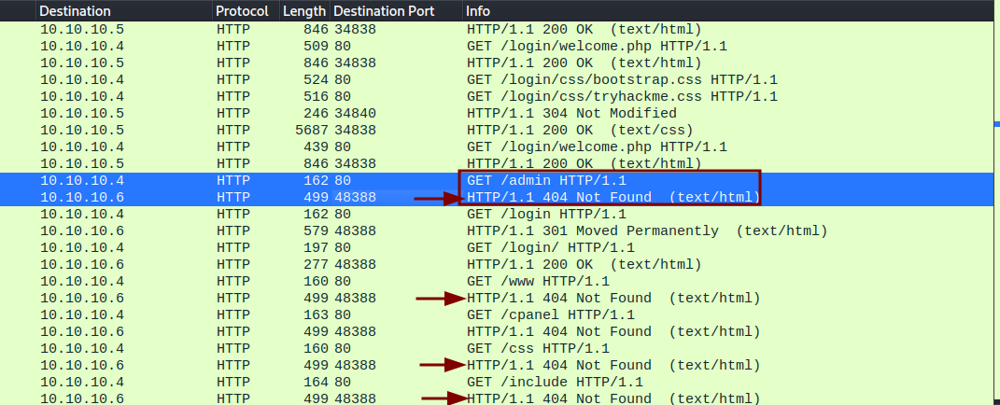

Of particular interest is the attempt to access `/admin`. Someone is snooping. If we want only [GET Request](../../../../Knowledge%20Base/Concepts/Web/GET%20Request.md) requests, then we can add to the `http` filter `request.method`and set it equal to `GET`

Enter this in the Wireshark filter bar.

```
http.request.method == GET
```

We can see a clearer picture of all the `GET` requests, and again we see the request for `/admin`. We knew this failed, however, and the question asks what directory was **found** on the server. If the directory is found, it will return a status code of `200`. We can filter for this with `http.response.code == 200`. Combine these two filters like below. We use `||` for `OR` to return both results. Without it, we would not be able to see the `GET` request that corresponds to the status code.

```
http.request.method == GET || http.response.code == 200
```

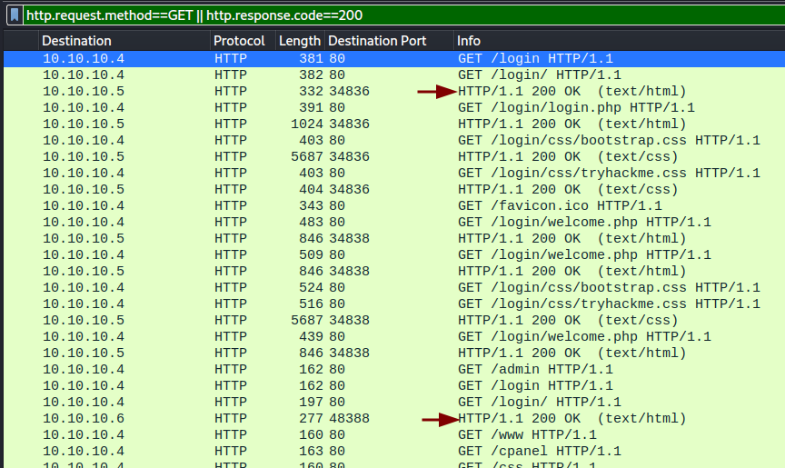

It looks like the only successful page found, the one with a status code of `200`, is `login`. Go ahead and answer question 1. 

> We can see that below the request for `admin`, however, there is no 200. This returned `404`. Try this search if you'd like.

### Question-2

In an `HTTP` post request, the data is not encrypted, this requires `SSL` or `TLS` over [HTTPS](../../../../Knowledge%20Base/Concepts/Web/HTTP(S).md). Because of this, we can read all the data that was submitted. [POST Request](../../../../Knowledge%20Base/Concepts/Web/POST%20Request.md) requests are often for when a user submits some data, everything from a comment on a blog to usernames, passwords, and credit card information. 

Similar to the `GET` filter, we can use the following to filter for `POST` requests. 

```
http.request.method == POST
```

There are only 3 `POST` requests of interest. The first thing we notice inspecting the packets in the middle *packet details pane* is a custom user agent field. Click any of the `POST` packets and look for the `User-Agent` field in the details pane. You'll see a custom `User-Agent` that contains our flag for question 3. 

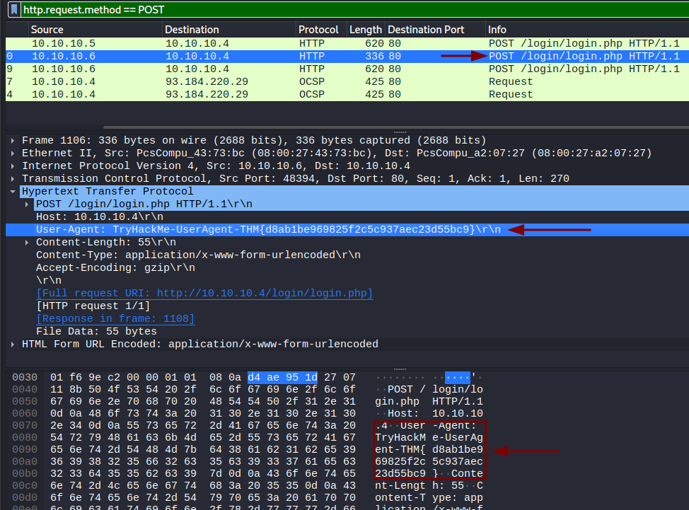

If you scroll down to the field `HTML Form URL Encoded:....` and expand it, you can see the form data the user-submitted and note a password and username.

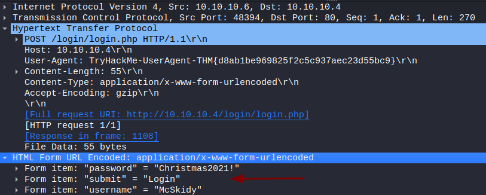

The `username:password` combination is the answer we need for question 2.

### Question-3

To view the flag we found in the `User-Agent` flag more cleanly, we can use a Wireshark utility named *"Follow Stream"*. Right-click the packet you selected and choose  `Follow` > `TCP Stream`. 

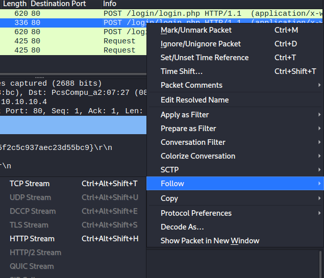

Here we see the packets collected into a "stream" of data for us to review. Right on top is the `User-Agent` field we saw in the packet details. We can also see the username and password, as well as a `PHPSESSID` that corresponds with *McSkidy's* current login [Sessions](../../../../Knowledge%20Base/Concepts/Web/Sessions.md). Lots of good information, especially if we captured this live. Copy this and submit it for your flag. 

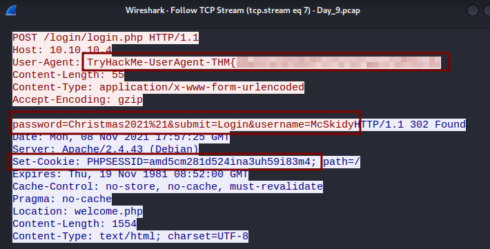

> Given the `session_id` [cookie](../../../../Knowledge%20Base/Concepts/Web/Cookies.md) of *McSkidy*, we could potentially perform some [session hijacking](../../../../Knowledge%20Base/Vulnerabilities/Session%20Hijacking.md). 

Copy this flag and enter it for question 3

### Question-4 

Question 4 asks us to find a flag in a `DNS` query with the type `TXT`. There are tons of these packets as our systems are constantly using `DNS` to look up records for sites we are trying to access, and for all the background services we don't realize are running (i.e., *Slack, Zoom, OneDrive, Google Drive*)

Instead of searching for the query we need, let's cheat a bit. Pick any packet and go to the queries sub-tree in the details pane. Right-click the `Type` field and choose `Apply as Column`. 

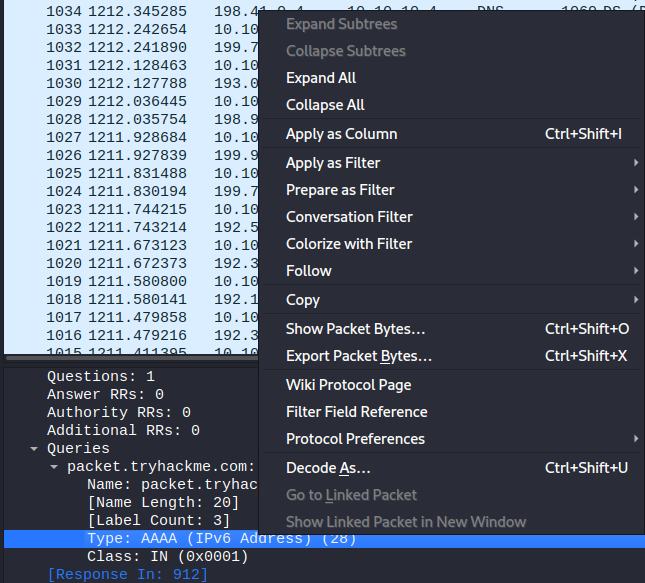

You now have a `Type` column in your main packet view. Sort the packets by `Type` by clicking the column and scroll until you find the `TXT` type and inspect the `response`. You'll see our flag listed in the `Answers` >  `packet.tryhackme.com` sub-tree. 

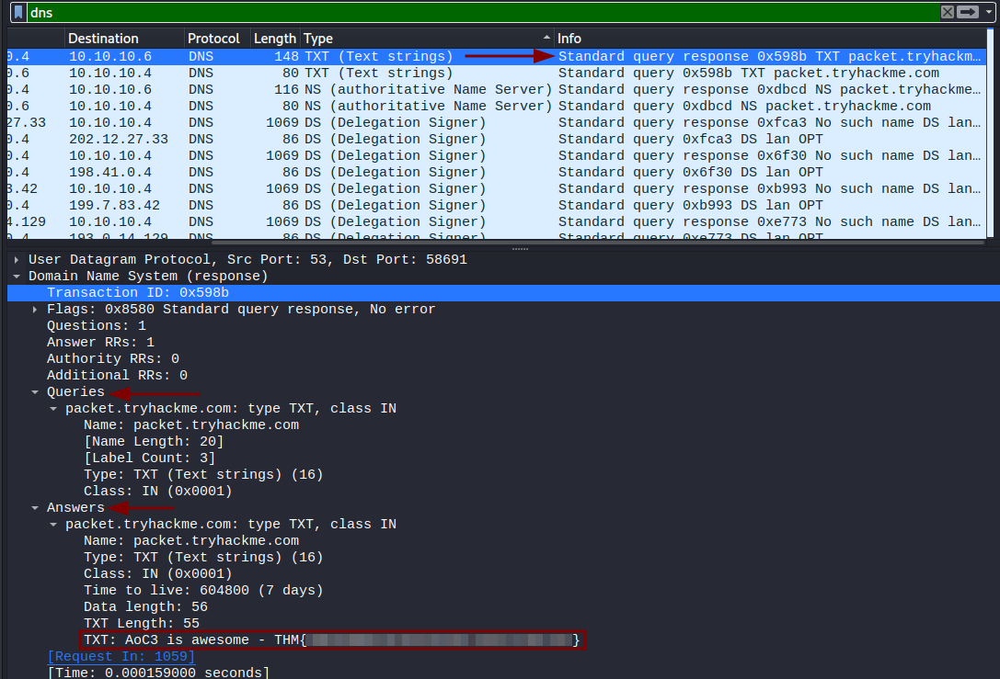

Right-click and follow the `UDP` stream to copy the flag and answer question 4

> ***Far easier*** than this is simply filtering for `dns.txt`, but this requires knowledge you may not have had. If you ever want to know how to filter for something specific you found in the packet details, simply right-click the field and select `Apply as Filter`.
>To cheat entirely, use the filter `dns.txt matches "[*+THM*+]"` to apply a `regex` to the `dns.txt` filter. It will return the response immediately. 


#### A note on the TryHackMe guide...

We are told to look for packets that query the TryHackMe server with a domain name `packet.tryhackme.com.` Use the filter `dns` to find these packets. 

The first packet visible looks like the one we want. It is a `Standard query` with the type `AAAA`. In the `Info` column we can see this data. It also has what is called a `Transaction ID`, referenced by the `0x....` information. Your IDs may vary, mine is `0xb46b`. 

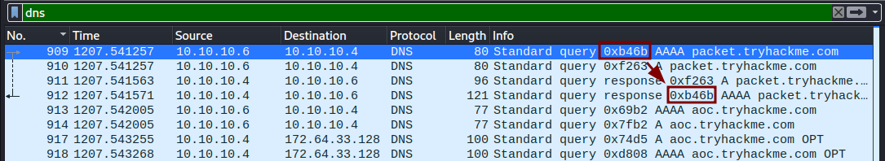

I have highlighted the matches here. Instead of clicking around, it is far easy to filter for the matching transaction ID. Once you find the request you are looking for, apply a filter with the transaction ID. Mine is `dns.id == 0xb46b` You'll see only the request and response returned. 

### Questions-5-6

The next question asks us to dig a password out of an `FTP` session. The thing to know about `FTP` is that people assume it only operates on one port, `21`, but there are two standard ports, `20` and `21`. This is because `FTP` separates user commands and data into two ports. In Wireshark, these two filters are `ftp` and `ftp-dat`. The first is used to see user commands, the second is for extracting and viewing data. 

Start with the filter `FTP` and you'll immediately see the username and password in the info column. You can also see this in the packet details pane. 

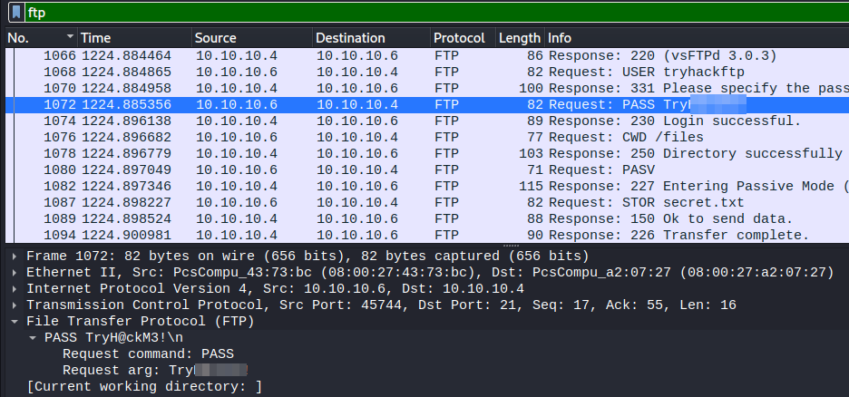

In this same image, we can see the command used to add the file `secret.txt` to the server. 

### Question-7

The final question asks us for the actual data stored in `secret.txt`. You can either follow the `TCP` stream of the session, starting with the login, or the command used to store the file. Alternatively, change your filter to `ftp-data` and look under the `Line-based text data` sub-tree to find the flag. 

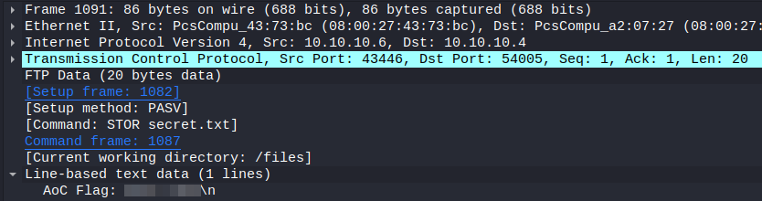

***Congratulations on completing this box!***  

See you at the next one &mdash; [Advent of Cyber 3 Day 10](Day%2010%20-%20Advent%20of%20Cyber%202021.md)
</br>
</br>
</br>
</br>
</br>
</br>
</br>
</br>
</br>
</br>
</br>
</br>
</br>
</br>
</br>
</br>
</br>
</br>
</br>
</br>
</br>
</br>
</br>
</br>
</br>
</br>
</br>
</br>
</br>
</br>
</br>
</br>
</br>
</br>
</br>
</br>
</br>
</br>
</br>
</br>
</br>
</br>
</br>
</br>
</br>
</br>
</br>
</br>
</br>
</br>
</br>
</br>
</br>
</br>
</br>
</br>
</br>
</br>
</br>
</br>
</br>
</br>
</br>
