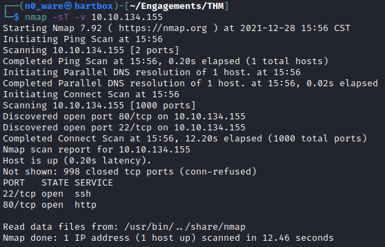
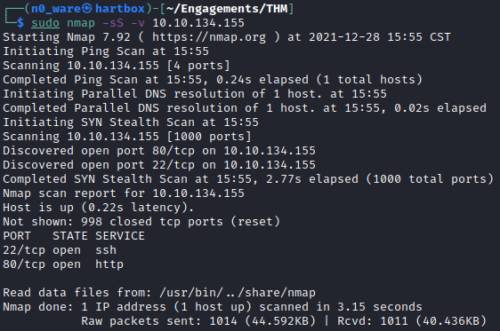
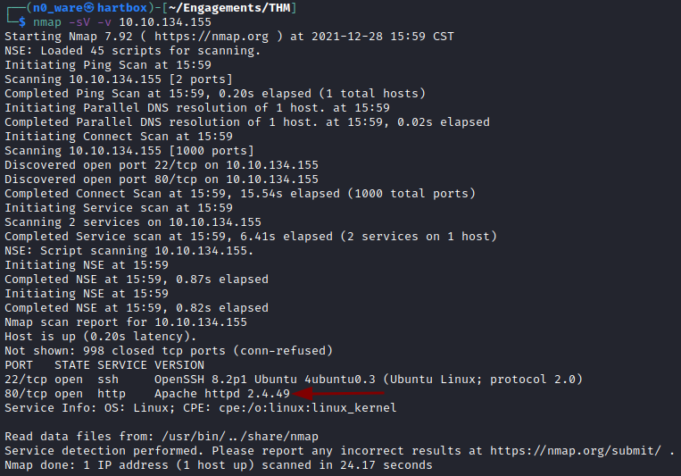
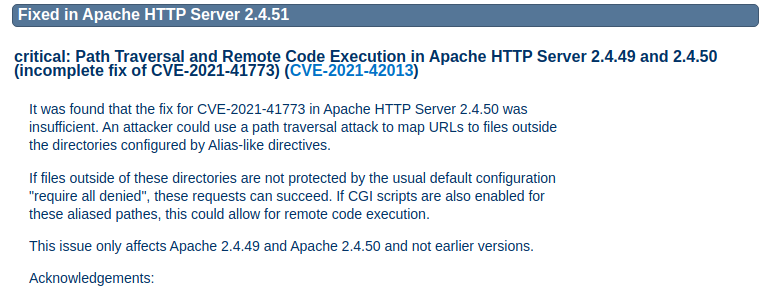
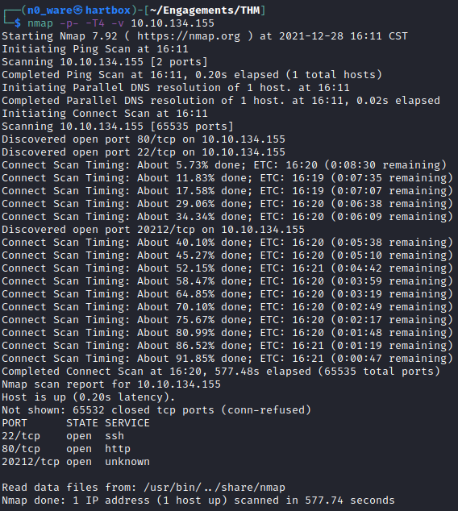
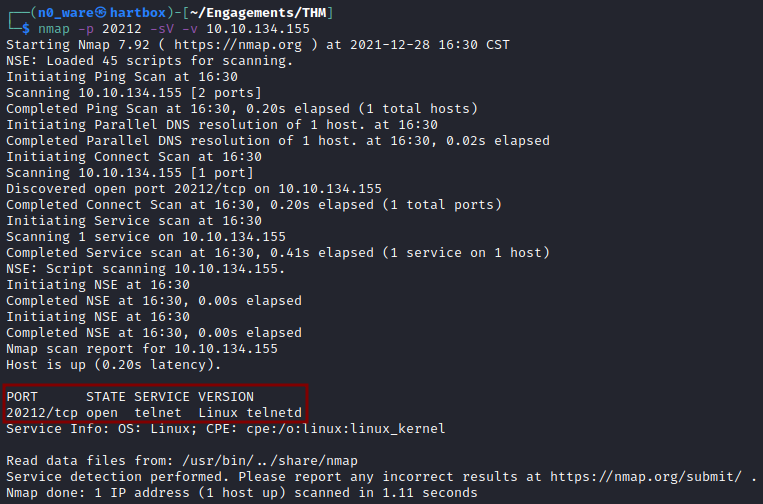
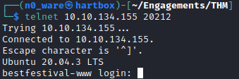

# TryHackMe - Advent of Cyber 2021 - Day 10
## Offense is the Best Defense (Networking)
> Edward Hartmann
> December 28, 2021

***<u>Refs/Links:</u>***
- [Advent of Cyber 2021 TOC](Advent%20of%20Cyber%20Table%20of%20Contents.md)  
-  Tags[^1]
-  Flag[^2]

[^1]: #nmap #enumeration
[^2]: *Question 1:* `2`
					*Question 2:* `22`
					*Question 3:* `http`
					*Question 4:* `Y`
					*Question 5:* `Apache httpd 2.4.49`
					*Question 6:* `CVE-2021-42013`
					*Question 7:* `20212`
					*Question 8:* `telnetd`

## TOC
- [Questions 1-3](#Questions-1-3)
- [Question 4](#Question-4)
- [Question 5](#Question-5)
- [Question 6](#Question-6)
- [Question 7](#Question-7)
- [Question 8](#Question-8)

## Walkthrough

In this box, we are tasked with a basic walkthrough of the various use cases, flags, and outputs of [Nmap](../../../../Tools,%20Binaries,%20and%20Programs/Information%20Gathering/Network%20Reconnaissance/Nmap.md). 

### Questions-1-3
[TOC](#TOC)
 
To start with we are using a `TCP`-connect scan. Run `nmap -sT -p 1-100 <TARGET_IP` and note the number of ports returned. 

We found two ports open on the machine. The smallest is `22` and the service related to the higher port is `http`.

### Question-4
[TOC](#TOC)
 
Next, we are performing a `syn`-scan. Run the command `sudo nmap -sS -v <TARGET_IP>`. This command takes much shorter than the prior one because it is not completing the *3-way handshake*. Note the difference at the bottom of each image. 

The output is otherwise the same. 

### Question-5
[TOC](#TOC)
 
Now we are going to check some versions. Run the command `nmap -sV -v <TARGET_IP>` and see the output. This will take longer than the previous two. 

Notice that we were returned service names and version numbers for the two open ports. The question asks for the version number only, but it actually wants the full service name and version number. 

### Question-6
[TOC](#TOC)
 
With a little research on this *Apache* version (at the link provided), we find a `CVE` number associated with this version related to *Path Traversal and Remote Code Execution* fixed in version 2.4.51. 

### Question-7
[TOC](#TOC)
 
With the fear of a possible backdoor listening on a high port, outside of the usual *Top 1000* that `nmap` scans by default, we want to scan the entire system. 

Run the command `nmap -p- -T4 -v <TARGET_IP>` to scan everything with a little extra speed by using `-T4`. **This will take about 5-10 minutes depending on your connection. **

> If you were genuinely concerned about a back door, I would add the `-Pn` flag to this to scan ports even if they do not respond to ping. See the [Nmap](../../../../Tools,%20Binaries,%20and%20Programs/Information%20Gathering/Network%20Reconnaissance/Nmap.md) note for more scans. 

After nearly 10 minutes, the scan was completed, exposing a single high port service running somewhere unusual. 
### Question-8
[TOC](#TOC)
 
 We want to know what precisely is running there. Had we run a version or script scan against the entire port range, we could have had an even longer wait for the results. Now that we know what specific port to scan, we can fine-tune the command. Run the command `nmap -p 20212 -sV -v <TARGET_IP>` and check the results
 
 
 
 Unfortunately for McSkidy, her server has a `telnet` service as a backdoor. Telnet is horribly insecure, never encrypted, and often poorly configured. This one has a password on it, but the passwords are often set to default if included at all. 
 
 
 
***Congratulations on completing this box!***  

See you at the next one &mdash; [Advent of Cyber 3 Day 11](Day%2011%20-%20Advent%20of%20Cyber%202021.md)
 
 
 
 
 
 
 
 
 
 
 
 
 
 
 
 
 
 
 
 
 
 
 
 
 
 
 
 
 
 
 
 
 
 
 
 
 
 
 
 
 
 
 
 
 
 
 
 
 
 
 
 
 
 
 
 
 
 
 
 
 
 
 
