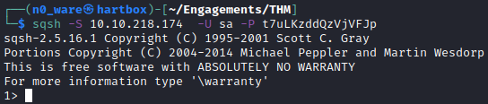
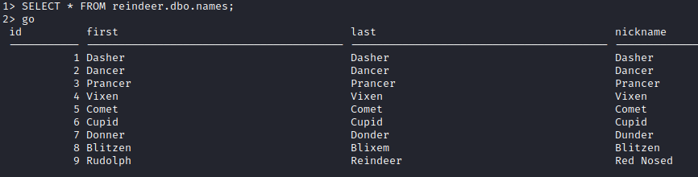
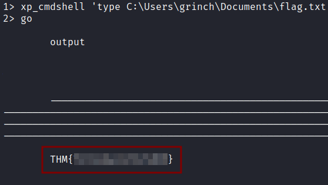

# TryHackMe - Advent of Cyber 2021 - Day 11
## Where are the Reindeers? (Networking)
> Edward Hartmann
> December 28, 2021

***<u>Refs/Links:</u>***
- [Advent of Cyber 2021 TOC](Advent%20of%20Cyber%20Table%20of%20Contents.md)  
-  Tags[^1]
-  Flag[^2]

[^1]: #sql #nmap #rdbms #sqsh 
[^2]:  *Question 1:* `1433`  
					*Question 2:* `1>`  
					*Question 3:* `Rudolph`  
					*Question 4:* `Prague`  
					*Question 5:* `25000`  
					*Question 6:* `THM{YjtKeUy2qT3v5dDH}`  


## TOC
- [Question 1](#Question-1)
- [Question2](#Question-2)
- [Question 3](#Question-3)
- [Question 4](#Question-4)
- [Question 5](#Question-5)
- [Question 6](#Question-6)

## Walkthrough
In this box, we are told that we have lost access to Santa's Reindeer Schedule stored in a [Relational Database Management System (RDBMS)](../../../../Knowledge%20Base/Concepts/Databases/Relational%20Database%20Management%20Systems.md) and need to not only regain access, but first find it on the system using [Nmap](../../../../Tools,%20Binaries,%20and%20Programs/Information%20Gathering/Network%20Reconnaissance/Nmap.md).

> **Note:** If you are familiar with `MySQL` commands, those will not apply here. You are using `MS SQL` over `sqsh`.

### Question-1
[Top](#TOC)

Firstly, we need to find the server. Since we don't know what port the service is running on, we'll need to version scan. Also, because we know it is a Windows system that won't respond to `ping`, we need a "*pingless*" [Nmap](../../../../Tools,%20Binaries,%20and%20Programs/Information%20Gathering/Network%20Reconnaissance/Nmap.md) on the top 1000 ports (default Nmap setting). Run the command `nmap -Pn -sV -v <TARGET_IP>`


### Question-2
[Top](#TOC)

With the service located, we need to log in. Using an interactive database shell called `sqsh` (*swkish*), we can access the server over the command line. Run the command `sqsh -S <TARGET_IP> -U sa -P t7uLKzddQzVjVFJp` where `-S` is the target IP, `-U` is the username, and `-P` is the password. If successful we will get a prompt similar to a terminal but in a different syntax.

> The "*prompt*" is what you see right before your cursor



### Question-3
[Top](#TOC)

Now that we have access and confirmed it is a [Microsoft SQL Server (MS SQL)l](../../../../Tools,%20Binaries,%20and%20Programs/Databases/Microsoft%20SQL%20Server%20(MSSQL).md) server, let's get some information. Note that after each query we type, you must follow it with `go` and that each query itself ends with a `;`. Otherwise, it will continue expecting more on the same query. 

First, the DB Admin told us the `reindeer` database contains three tables &mdash; 
- `names`
- `presents
- `schedule`  

We want some data from`reindeer`. Run the command `SELECT * FROM reindeer.dbo.names;` followed by `go`. 



Recalling the guide, remember that a query is structured like `SELECT * FROM table_name WHERE condition`. The `*`is selecting all columns in this case, but we could be specific. 

To return only the `9th` id, we run the command `SELECT first FROM reindeer.dbo.names WHERE id = 9;`


And there you have it, our buddy *Rudolph* at number 9.
### Question-4
[Top](#TOC)

For this question, we are asked to get some data from the `schedule` table. Using the same syntax, we are going to swap `names` for `schedule` in the `table_name` portion of the query. Run the command `SELECT * FROM reindeer.dbo.schedule` and view the output. We don't need the `id` or `notes` field here, so trim the command down to `SELECT date,destination FROM reindeer.dbo.schedule`


There we go, a nice clean output. 
### Question-5
[Top](#TOC)

Now we are asked how many "Power Bank" presents we need. Guessing standard column names, we can run the query `SELECT quantity,name FROM reindeer.dbo.presents WHERE name = 'Power Bank';` and view the output. 

> Quotes in most `SQL` systems are single, not double. &mdash; `'` vs `"`. 


### Question-6
[Top](#TOC)

Now we need to see if we can get some information off the server itself. We are told that some **MS SQL** servers have `xp_cmdshell` enabled for us to run commands somewhat like a command prompt. Each command has the syntax `xp_cmdshell 'COMMAND'`. `whoami`, for example, runs on this server. 

```
xp_cmdshell 'whoami'
```


We are told there is a hidden file in the home directory of the user `grinch`. We need to find out a few things
1. Where are we now
2. Where are we relative to the `grinch` home directory
3. Can we change directories
4. Or, can we list items and read contents from the current directory

For number 1, we can use the Windows version of the *UNIX* `pwd` &mdash; `echo %cd%`

Run `xp_cmdshell 'echo %cd%'`


Knowing this, we can attempt to change to the directory we want, which is likely `C:\Users\grinch`. 

Run `xp_cmdshell 'cd C:\Users\grinch'` to see if we can change directories....that doesn't work. 

Let's switch gears and see if we can list files in a directory from our current location with `dir`. Run `xp_cmdshell 'dir -Force C:\Users\grinch'` and note the output. We need `-Force` because we are told the file is hidden, and this flag will show us **all** files, hidden or not. 

Unfortunately, still no file....let's try the `Documents` folder. Run `xp_cmdshell 'dir -Force C:\Users\grinch\Documents'`

Bingo! Found the file **TryHackMe send us on a bit of a goose chase on this one looking for a file in the Documents directory and not the Home directory***.


Anyway, we can read Windows files from the command-line with the `type` command. Run `xp_cmdshell 'type C:\Users\grinch\Documents\flag.txt'`

There's our flag!



***Congratulations on completing this box!***  

See you at the next one &mdash; [Advent of Cyber 3 Day 12](Day%2012%20-%20Advent%20of%20Cyber%202021.md)
</br>
</br>
</br>
</br>
</br>
</br>
</br>
</br>
</br>
</br>
</br>
</br>
</br>
</br>
</br>
</br>
</br>
</br>
</br>
</br>
</br>
</br>
</br>
</br>
</br>
</br>
</br>
</br>
</br>
</br>
</br>
</br>
</br>
</br>
</br>
</br>
</br>
</br>
</br>
</br>
</br>
</br>
</br>
</br>
</br>
</br>
</br>
</br>
</br>
</br>
</br>
</br>
</br>
</br>
</br>
</br>
</br>
</br>
</br>
</br>
</br>
</br>
</br>
