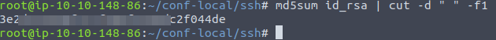

# TryHackMe - Advent of Cyber 2021 - Day X
## Sharing without Caring (Networking)
> Edward Hartmann
> December 29, 2021

***<u>Refs/Links:</u>***
- [Advent of Cyber 2021 TOC](Advent%20of%20Cyber%20Table%20of%20Contents.md)  
-  Tags[^1]
-  Flag[^2]

[^1]: #nfs #nmap #mount
[^2]: *Question 1:* `7`  
					*Question 2:* `2049`  
					*Question 3:* `4`  
					*Question 4:* `3`  
					*Question 5:* `Meditations`  
					*Question 6:* `Confidential`  
					*Question 7:* `3e2d315a38f377f304f5598dc2f044de`  

## TOC
- [Questions 1-2](#Questions-1-2)
- [Questions 3-4](#Questions-3-4)
- [Question 5](#Question-5)
- [Questions 6-7](#Questions-6-7)

## Walkthrough

In this box, we are instructed that there is a need to analyze some unusual network traffic and also must identify an [Network File System (NFS)](../../../../Knowledge%20Base/Concepts/Network%20File%20System%20(NFS).md) service on an IP within our network. 
### Questions-1-2
[Top](#TOC)

Our first task is identifying the services on our target IP with [Nmap](../../../../Tools,%20Binaries,%20and%20Programs/Information%20Gathering/Network%20Reconnaissance/Nmap.md). It is a windows host, so it will block scans with a ping. Run the following `Nmap`

```
nmap -Pn -sV 10.10.113.135
```

The `NFS` service is named `mountd` or `nfs` depending on if you used the `-sV` flag or not. 


### Questions-3-4
[Top](#TOC)

To identify the available *mounts* or *shares* on the service, use the command:

```
showmount -e <TARGET_IP>
```


The *shares* available on this `NFS` don't seem like something anyone should be able to access...
- `/share`
- `/admin-files`
- `/my-notes`
- `/confidential`

Furthermore, all but `/my-notes` are labeled as `everyone`.
### Questions-5
[Top](#TOC)

> **Note**: Switched to TryHackMe Attack Box to complete the remainder
Let's check our access. Attempt to mount a the `NFS` directory `/my-notes` to our local `/tmp1` directory.

```
mount <TARGET_IP>:/my-notes tmp1
```


Looks like our mount was denied. Let's try with `/share`.

```
mount <TARGET_IP>:/share tmp1
```


No answer is a good answer, this was a successful mount. We now have access to the `/share` folder through our `/tmp1` directory. We can now explore this director as we would any on our system. Let's see what files are available on this *share*. 

```
cd tmp1

ls tmp1
```


We have to files on this share. Let's use `less` to view the first 10 lines of each of the files. Focusing on `2680-0.txt` we get the answer to this question. 


### Questions-6-7
[Top](#TOC)

Lastly, we want to access the forgotten *SSH authentication key*. This will be an `id_rsa` file most likely. Finding this file will require mounting and listing the files in the other shares. Keep in mind the file may be hidden. 

Move out of the `tmp1` directory and create a new temporary directory for each of the remaining two shares. Mount each of these to your system and enumerate the contents of these shares. This can be done with two easy commands

```
mkdir admin-local && mount <TARGET_IP>:/admin-files admin-local

mkdir conf-local && mount <TARGET_IP>:/confidential conf-local
```

The second command returns no output, indicating a successful mount. 


Navigate to this directory until you locate the `id_rsa` file in question. To generate the proper flag for this quesiton, we need the `md5sum` command. Use this with the name of the file. 

The [`cut`](../../../../Tools,%20Binaries,%20and%20Programs/CLI%20Utilities/cut.md) command here is used to strip the unnecessary content from the output, with `-d " "` specifying a *space* as the delimiter and `-f1` returning just the first field.

```
md5sum id_rsa | cut -d " " -f1
```



There you have it! 

***Congratulations on completing this box!***  

See you at the next one &mdash; [Advent of Cyber 3 Day 13](Day%2013%20-%20Advent%20of%20Cyber%202021.md)
</br>
</br>
</br>
</br>
</br>
</br>
</br>
</br>
</br>
</br>
</br>
</br>
</br>
</br>
</br>
</br>
</br>
</br>
</br>
</br>
</br>
</br>
</br>
</br>
</br>
</br>
</br>
</br>
</br>
</br>
</br>
</br>
</br>
</br>
</br>
</br>
</br>
</br>
</br>
</br>
</br>
</br>
</br>
</br>
</br>
</br>
</br>
</br>
</br>
</br>
</br>
</br>
</br>
</br>
</br>
</br>
</br>
</br>
</br>
</br>
</br>
</br>
</br>
