# TryHackMe - Advent of Cyber 2021 - Day 14
## Dev(Insecure)Ops (Networking)
> Edward Hartmann
> January 2, 2022

***<u>Refs/Links:</u>***
- [Advent of Cyber 2021 TOC](Advent%20of%20Cyber%20Table%20of%20Contents.md)  
-  Tags[^1]
-  Flag[^2]

[^1]: #cicd #permissions #webapp
[^2]: *Question 1:* `4`  
					*Question 2:* `4`  
					*Question 3:* `ZUP42`  
					*Question 4:* `DI3H4rdIsTheBestX-masMovie!`  

## TOC
- [Question 1](#Question-1)
- [Question 2](#Question-2)
- [Question 3](#Question-3)
- [Question 4](#Question-4)

## Walkthrough
In this box we are learning about [CI/CD (Continuous Integration/Continuous Delivery)](../../../../Knowledge%20Base/Concepts/Continuous%20Integration%20Continuous%20Delivery%20(CICD).md) and the potential risks involved. The Grinch has installed his own *CI/CD* pipeline and we need to investigate what is happening. He has used a variety of `BASH` scripts to facilitate his pipeline. 

### Question-1
[Top](#TOC)
The landing page of our target IP address gives us an image of The Grinch waiting for some *L00T!* and with nothing else on the page. 


From here, with nothing else visible on the page, enumeration is the next logical step. For locating hidden directories on websites, we can use [dirbuster](../../../../Tools,%20Binaries,%20and%20Programs/Information%20Gathering/Web%20Applications/dirbuster.md) via the `dirb` command and use a basic word list. I am using one of the many built-in *Kali* word lists in the `dirb` folder &mdash; `common.txt`. Run the following command. 

```
dirb https://<TARGET_IP> /usr/share/wordlists/dirb/common.txt
```

> Note that this is the default list `dirb` uses if you do not specify another one. 

About a minute or two into the process, it will locate the `/admin` directory. 

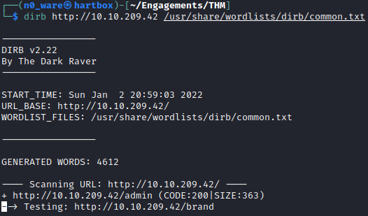

Let this continue to run through the entire list so you can answer *Question 1*  with the number of directories returned. 

### Question-2
[Top](#TOC)

Now that we've found an entry point, let's investigate. A good practice when investigating a web application is to check the source code. Immediately, we notice an `<iframe>` that calls to a source, `ls.html`, that looks a lot like it is *listing* the contents of a directory, much like the Linux `ls` command. 

> To verify this is running on Linux, check the Operating Stem with [Nmap](../../../../Tools,%20Binaries,%20and%20Programs/Information%20Gathering/Network%20Reconnaissance/Nmap.md) and the `-O` flag. 

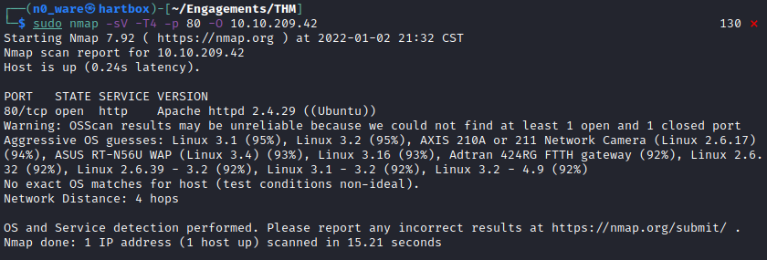

With the information on the *OS* and the knowledge of `ls.html`, it is time we dig deeper. Attempt to navigate to the `ls.html` page. This page is the source of the `<iframe>` and we can access it directly. This may be a sign we can abuse the command 

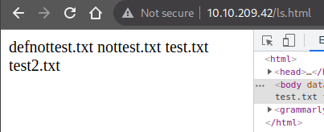

Skipping the step where we have to find a username and attempt to brute force it, we are given the combination `mcskidy:Password1` to access via ssh. Access via the in-browser machine or run the command `ssh mcskidy@<TARGET_IP>` and enter the password. 

Once on the system, a quick listing of the contents of our home directory turns up no files or folders. A quick way to enumerate users is to list the contents of the `/etc/passwd` directory and filter for users with a proper `/bash`. Run the command `cat /etc/passwd | grep "/bin/bash"`

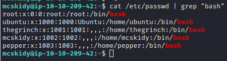

The obvious user of interest is `thegrinch`. Let's see what we can access on this user. Change to this user's home directory run `ls`. We see both a `loot` directory and a directory named `scripts`. Moving into scripts and listing the files with `ls -l` tells us that all of the scripts are owned by root and that we only have access to one of them, the `loot.sh` script. This can be seen via the lack of `r` or `w` or `x` on the permissions line after the first set of three in the command output. 

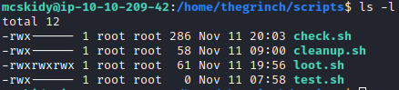

### Question-3
[Top](#TOC)

The output of this `ls` tells us two things. First, we can read, write, and execute this script. Second, this script has admin privileges as it is owned by the `root` user. If you `cat` the script, you'll also see this is the script responsible for the output on the `ls.html` page and the `<iframe>` we see on the admin page. This script is listing the `loot` directory and writes the output to `ls.html`. 

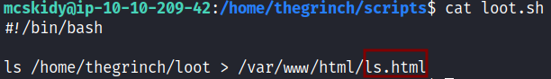

To edit this file in a way it outputs the information we need for *Question 3*, open `loot.sh` with a text editor and replace the code with the following. 

```
#!/bin/bash

cat /etc/shadow > /var/www/html/ls.html
```

We still cannot execute `loot.sh`, but we can use the browser to execute it for us. Navigate back to the `admin` page in your browser and refresh until you have an output like the image below. 

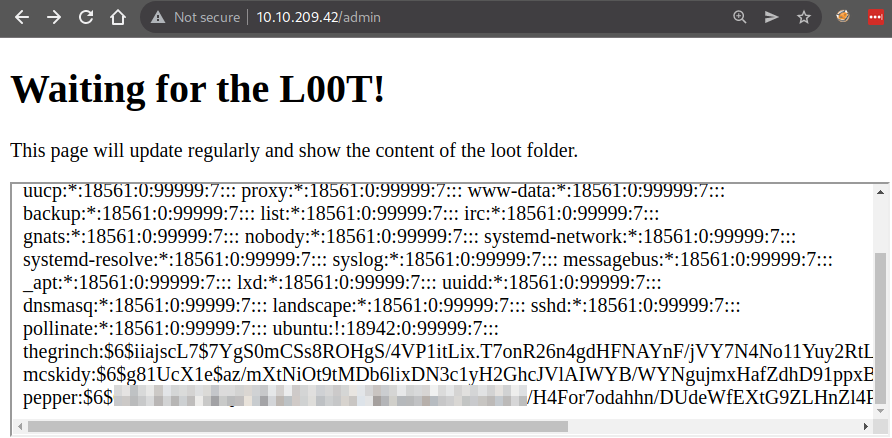

Just like that, we have read the contents of a `root` owned file using a hosted script. Go ahead and use this to answer *Question 3*

### Question-4
[Top](#TOC)

Now that we know the `loot.sh` file can be abused, similarly edit the code to list out the contents of the other `sh` files we cannot read on the command line. You can do this one at a time, or customize the `loot.sh` file to do it all at once. 

```
#!/bin/bash
echo "Check Script ----- " > /var/www/html/ls.html
cat /home/thegrinch/scripts/check.sh >> /var/www/html/ls.html
echo "Cleanup Script ----- " >> /var/www/html/ls.html
cat /home/thegrinch/scripts/cleanup.sh >> /var/www/html/ls.html
echo "Test Script ----- " >> /var/www/html/ls.html
cat /home/thegrinch/scripts/test.sh >> /var/www/html/ls.html
```

Add this code and wait a few minutes. You should get the output below if successful. 

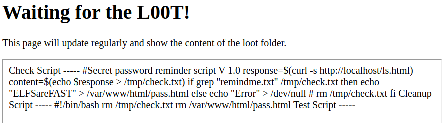

This can be hard to read all on one line with no breaks, but essentially, the `$reesponse` variable is given a value that results in a `curl` command that returns the contents of `ls.html`. If there is a file `remindme.txt` in that list, the script returns the value `ELFSareFAST` to `pass.html`. 

Using this password, we can log in as `thegrinch` with the command `su -l thegrinch`

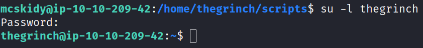

Unfortunately, this won't help with the flag because it is owned by the `root` user, but we can use the same information disclosure method to read the flag. 

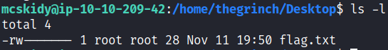

Edit the `loot.sh` file to read the contents of `/home/thegrinch/Desktop/flag.txt`, wait a few minutes, and refresh the page.

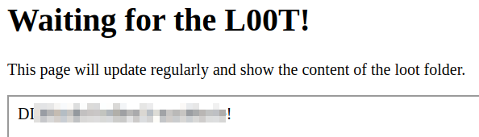

***Congratulations on completing this box!***  

See you at the next one &mdash; [Advent of Cyber 3 Day 16](Day%2016%20-%20Advent%20of%20Cyber%202021.md)
</br>
</br>
</br>
</br>
</br>
</br>
</br>
</br>
</br>
</br>
</br>
</br>
</br>
</br>
</br>
</br>
</br>
</br>
</br>
</br>
</br>
</br>
</br>
</br>
</br>
</br>
</br>
</br>
</br>
</br>
</br>
</br>
</br>
</br>
</br>
</br>
</br>
</br>
</br>
</br>
</br>
</br>
</br>
</br>
</br>
</br>
</br>
</br>
</br>
</br>
</br>
</br>
</br>
</br>
</br>
</br>
</br>
</br>
</br>
</br>
</br>
</br>
</br>
