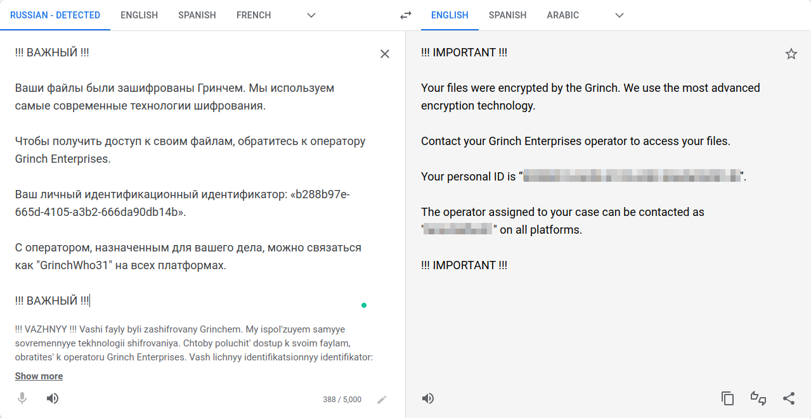

# TryHackMe - Advent of Cyber 2021 - Day X
## Ransomware Madness (OSINT)
> Edward Hartmann
> January 3, 2022

***<u>Refs/Links:</u>***
- [Advent of Cyber 2021 TOC](Advent%20of%20Cyber%20Table%20of%20Contents.md)  
-  Tags[^1]
-  Flag[^2]

[^1]: #osint
[^2]: *Question 1:* `GrinchWho31`  
					*Question 2:* `Keybase`  
					*Question 3:* `1GW8QR7CWW3cpvVPGMCF5tZz4j96ncEgrVaR`  
					*Question 4:* `Keybase.io`  
					*Question 5:* `bc1q5q2w2x6yka5gchr89988p2c8w8nquem6tndw2f`  
					*Question 6:* `GitHub`  
					*Question 7:* `DonteHeath21@gmail.com`  
					*Question 8:* `Donte Heath`  

## TOC
- [Question 1](#Question-1)
- [Question 2](#Question-2)
- [Question 3](#Question-3)
- [Question 4](#Question-4)
- [Question 5](#Question-5)
- [Question 6](#Question-6)
- [Question 7](#Question-7)
- [Question 8](#Question-8)


## Walkthrough
This box is dedicated to the art of Open Source Intelligence gathering, aka [Open Source Intelligence (OSINT)](../../../../Knowledge%20Base/Concepts/Open%20Source%20Intelligence%20(OSINT).md). In this walkthrough, we will detail the shortest route I have identified to answer your question. 

### Question-1
[Top](#TOC)

Firstly, we are given a ransomware note in a language that you (likely) cannot read. The first goal should be to translate the note via [Google Translate]https://translate.google.com/). Paste in the ransomware text below and it will auto-detect the language and output the translation in English or your language of choice. 

```
!!! ВАЖНЫЙ !!!

Ваши файлы были зашифрованы Гринчем. Мы используем самые современные технологии шифрования.

Чтобы получить доступ к своим файлам, обратитесь к оператору Grinch Enterprises.

Ваш личный идентификационный идентификатор: «b288b97e-665d-4105-a3b2-666da90db14b».

С оператором, назначенным для вашего дела, можно связаться как "GrinchWho31" на всех платформах.

!!! ВАЖНЫЙ !!!
```



Great! We have our starting point, a username available "on all platforms".

> Note: In any engagement scenario, we would also make sure to note the personal ID `b288b97e-665d-4105-a3b2-666da90db14b`
### Question-2
[Top](#TOC)

The next step is to see if we can locate anything interesting with that username with a simple Google search. Using [Google Dorking](../../../../Knowledge%20Base/Concepts/Open%20Source%20Intelligence%20(OSINT).md#Google) we can use a simple search function to return only results with that username to start with. Type `+` before the username into Google and search. 


Just like that, we can find an account on one service, and a post that looks a lot like our culprit claiming McSkidy will be defeated. Unfortunately, none of these is the answer we are looking for at a glance, though they are useful later. Try searching with a well-known site for quick public conversations and political diatribes to see if you can find the answer

> A little birdy gave me the **hint** to this one. 


### Question-3
[Top](#TOC)

Once you locate the social media profile of the Neighborhood Grinch, you'll see that they provide a cryptographic key for a self-verification that is the answer to *Question 3*


### Question-4
[Top](#TOC)

Inspecting the above social media post closely, you can easily identify the website this key is associated with for *Question 4*

### Question-5
[Top](#TOC)

After verifying the website this user belongs to in the image above and confirming they are the same individual via their verification link, we can see their *Bitcoin* wallet displayed as another artifact for our investigation. 


### Question-6
[Top](#TOC)

Identifying the location of the BTC address leak is as simple as viewing the verifications in the account history. Click the BTC address in the user's account and you will see a history of this user. 


This is excellent, we have connected a second website with a second username connected to the first. Head to the second website listed (with an account we have not investigated yet) and search for the newly identified user. 


There is a piece of code stored on this website under the new user that contains a BTC address embedded in the code. Find this, and you have found the leak repository.

### Question-7
[Top](#TOC)

In another of the repositories located on this website the email was committed and then removed. See if you can browse the histories of the commits and identify the email. 


### Question-8
[Top](#TOC)

On this same code commit, you can locate the original user's real name as well. 

***Congratulations on completing this box!***  

See you at the next one &mdash; [Advent of Cyber 3 Day 17](Day%2017%20-%20Advent%20of%20Cyber%202021.md)
</br>
</br>
</br>
</br>
</br>
</br>
</br>
</br>
</br>
</br>
</br>
</br>
</br>
</br>
</br>
</br>
</br>
</br>
</br>
</br>
</br>
</br>
</br>
</br>
</br>
</br>
</br>
</br>
</br>
</br>
</br>
</br>
</br>
</br>
</br>
</br>
</br>
</br>
</br>
</br>
</br>
</br>
</br>
</br>
</br>
</br>
</br>
</br>
</br>
</br>
</br>
</br>
</br>
</br>
</br>
</br>
</br>
</br>
</br>
</br>
</br>
</br>
</br>
