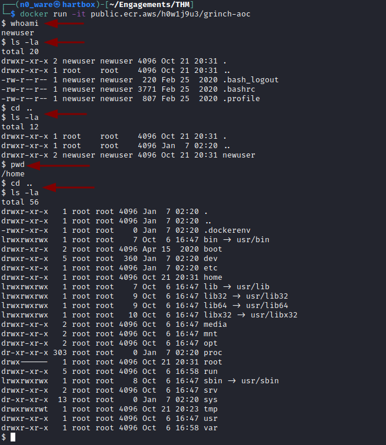

# TryHackMe - Advent of Cyber 2021 - Day 18
## Playing With Containers (Cloud)
> Edward Hartmann
> DATE

***<u>Refs/Links:</u>***
- [Advent of Cyber 2021 TOC](Advent%20of%20Cyber%20Table%20of%20Contents.md)  
-  Tags[^1]
-  Flag[^2]

[^1]: #docker #aws #containers 
[^2]: *Question 1:* `docker images`  
					*Question 2:* `docker save`  
					*Question 3:* `manifest.json`  
					*Question 4:* `7095b3e9300542edadbc2dd558ac11fa`  

## TOC
- [Install](#Install)
- [Question 1](#Question-1)
- [Question 2](#Question-2)
- [Question 3](#Question-3)
- [Question 4](#Question-4)

## Walkthrough
In this lab we are interacting with [Docker](../../../../Knowledge%20Base/Concepts/Docker.md) images hosted on AWS Elastic Container Registry. An image has been erroneously made available to the public and it is our task to investigate to understand the tooling resources Grinch Enterprises is using against us. We expect there to be some information beneficial to our cause on this image and we want to extract it

### Install

> To install Docker on a Kali instance, run the following commands:
```
sudo apt update
sudo apt install -y docker.io
sudo systemctl enable docker --now

## To add yourself to the docker group to use without sudo
sudo usermod -aG docker $USER
```

To start this lab, we are going to `pull` the image provided for us so we can run it locally. We could instead skip the `pull` and use the `run` command, but it will still download first then initialize. 

```
docker pull public.ecr.aws/h0w1j9u3/grinch-aoc:latest
```


### Question-1
[Top](#TOC)

The first question asks us what command we would use to list the container images stored in your local registry. The answer is given in the guide in the beginning steps, `docker images`. 

See the result of this command in the image above.

We can `run` the docker image and begin using it as a proper container that simulates a shell with the following command. The input field of this particular shell starts with a `$` and you can see the commands ran noted in the image. 

```
docker run -it public.ecr.aws/h0w1j9u3/grinch-aoc
```



Exit the Docker terminal with the `exit` command. 
### Question-2
[Top](#TOC)

The next is another simple question, asking us how we would save a docker image as a `.tar` archive. This is also available in the beginning guide and is accomplished with `docker save`.

Let's go ahead and save the remote container to our system now. 

```
docker save -o aoc.tar public.ecr.aws/h0w1j9u3/grinch-aoc:latest
```


### Question-3
[Top](#TOC)

In preparation for the next steps, we want to extract this tarball with the `tar` command. Run the command below to view the extracted files. 

```
tar -xvf aoc.tar
```

These are `JSON` objects that tell inform the creation of the [container image](../../../../Knowledge%20Base/Concepts/Container%20Images.md) we downloaded. The document `manifest.json` is just that, a list of all the contents within the file. We can use a tool named `jq` to print these files far more cleanly than with `cat` alone. Install it with `apt install jq -y` and pipe the output of `cat` into it as below. 

```
cat manifest.json | jq
```


### Question-4
[Top](#TOC)

The file noted in `config` contains all of the underlying commands to configure this container image and may have some good information. Printing this through `jq` we see a curious clone of a GitHub repo called [`envconsul`](https://github.com/hashicorp/envconsul), which helps launch subprocesses with environment variables in a docker container. Given it was cloned into a root directory, there is a chance it is sensitive. 

According to the instructions, one layer in all of the subdirectories in this tarball is of special interest. It is a bit painstaking, but you must navigate to teach of  the directories and extract the `layer.tar` file until you locate a `root` directory that contains the folder `envconsul` with the file `config.hcl`. Inside of that, we can find a token that we need for the last flag. 


While it was not required, the `printenv` command while running the container and the config file both listed an `api_key` that could also be used against Grinch Enterprises. 


***Congratulations on completing this box!***  

See you at the next one &mdash; [Advent of Cyber 3 Day 19](Day%2019%20-%20Advent%20of%20Cyber%202021.md)
</br>
</br>
</br>
</br>
</br>
</br>
</br>
</br>
</br>
</br>
</br>
</br>
</br>
</br>
</br>
</br>
</br>
</br>
</br>
</br>
</br>
</br>
</br>
</br>
</br>
</br>
</br>
</br>
</br>
</br>
</br>
</br>
</br>
</br>
</br>
</br>
</br>
</br>
</br>
</br>
</br>
</br>
</br>
</br>
</br>
</br>
</br>
</br>
</br>
</br>
</br>
</br>
</br>
</br>
</br>
</br>
</br>
</br>
</br>
</br>
</br>
</br>
</br>
