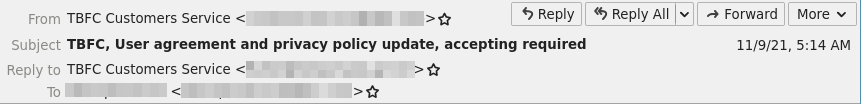
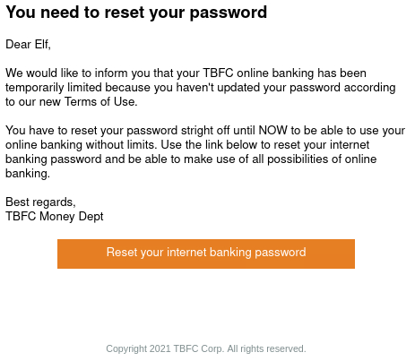
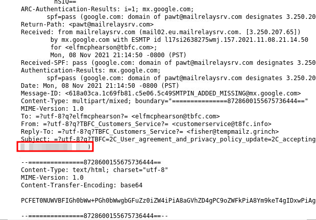
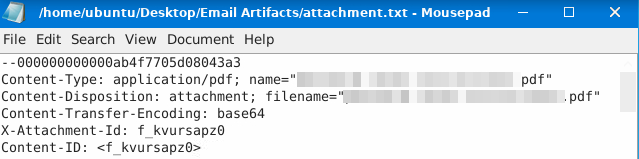
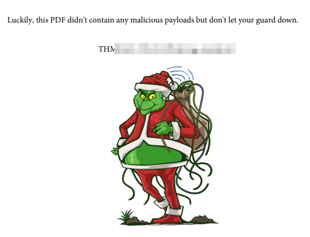

# TryHackMe - Advent of Cyber 2021 - Day 19
## Something Phishy is Going On (Blue Teaming)
> Edward Hartmann
> January 8, 2022

***<u>Refs/Links:</u>***
- [Advent of Cyber 2021 TOC](Advent%20of%20Cyber%20Table%20of%20Contents.md)  
-  Tags[^1]
-  Flag[^2]

[^1]: #phishing #socialengineering #blue #ir #encoding 
[^2]: *Question 1:* `elfmcphearson@tbfc.com`  
					*Question 2:* `customerservice@t8fc.info`  
					*Question 3:* `fisher@tempmailz.grinch`  
					*Question 4:* `stright`  
					*Question 5:* `https://89xgwsnmo5.grinch/out/fishing/` 
					*Question 6:* `X-GrinchPhish: >;^)`  
					*Question 7:* `password-reset-instructions.pdf`  
					*Question 8:* ` `  

## TOC
- [Question 1](#Question-1)
- [Questions 2-3](#Questions-2-3)
- [Question 3](#Question-3)
- [Question 4](#Question-4)
- [Question 5](#Question-5)
- [Question 6](#Question-6)
- [Question 7](#Question-7)
- [Question 8](#Question-8)

## Walkthrough
In this box, we are dealing with a [Phishing](../../../../Knowledge%20Base/Concepts/Phishing.md) scenario where McSkidy has gotten multiple reports of attempts to phish multiple elves. One of the emails contained an attachment, formatted as a `.eml` file along with some `base64` [encoded](../../../../Knowledge%20Base/Concepts/General/Encoding%20and%20Decoding.md) text. Lets investigate. 

> We will use the attack box for this challenge.

### Question-1
[Top](#TOC)

Question one asks who the email was sent to. Open the email per the instructions and click on it. Look at the email `From`, `Subject`, `Reply to`, and `To` lines to answer this question. 



### Questions-2-3
[Top](#TOC)

Next, we are asked to note the difference in the `From` and `Reply-to` email addresses, while also noting the similarity the `From` email has to the actual domain they are attempting to spoof. Find that in the image above as well. 

### Question-4
[Top](#TOC)

A common [sign of phishing](../../../../Knowledge%20Base/Concepts/Phishing.md#Signs) is a misspelled email, grammar error, or another surprising mistake in the body of an email. Take look at the text and see if you can spot it. 



### Question-5
[Top](#TOC)

Next, we want to investigate the link to whatever website this malicious email is sending us to. Right-click the button and choose to copy the link. This is the answer to this question. 

### Question-6
[Top](#TOC)

Now, click on "More" and "View Source" to see the source code of the email. The source of an email consists of many items, including [headers](../../../../Knowledge%20Base/Concepts/Phishing.md#Headers). One of the headers here does not belong and seems ..."phishy."



### Question-7
[Top](#TOC)

McSkidy has received several "artifacts" from other phishing emails sent to TBFC and has saved them on the desktop. Open that file and investigate them. Open `attachment.txt` and locate the name of the attachment. 



### Question-8
[Top](#TOC)

Finally, we need to find the flag in this challenge. We are told that the content of this attachment is `base64` encoded via the `Content-Transfer-Encoding: ` line. There is a very good chance this is a `PDF` file, but we want to be sure. 

To best decode this file into a type that we can read, we will use the command line. In a terminal, navigate to the `Desktop` and run the following command:

```
cat attachment-base64-only.txt | base64 -d > file.pdf
```

Head to the artifacts folder, and open this file. 



Here's our flag!

***Congratulations on completing this box!***  

See you at the next one &mdash; [Advent of Cyber 3 Day 20](Day%2020%20-%20Advent%20of%20Cyber%202021.md)
</br>
</br>
</br>
</br>
</br>
</br>
</br>
</br>
</br>
</br>
</br>
</br>
</br>
</br>
</br>
</br>
</br>
</br>
</br>
</br>
</br>
</br>
</br>
</br>
</br>
</br>
</br>
</br>
</br>
</br>
</br>
</br>
</br>
</br>
</br>
</br>
</br>
</br>
</br>
</br>
</br>
</br>
</br>
</br>
</br>
</br>
</br>
</br>
</br>
</br>
</br>
</br>
</br>
</br>
</br>
</br>
</br>
</br>
</br>
</br>
</br>
</br>
</br>
