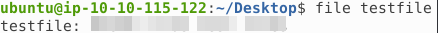
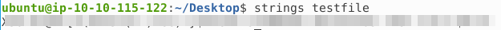
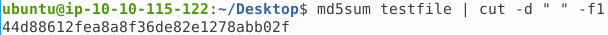
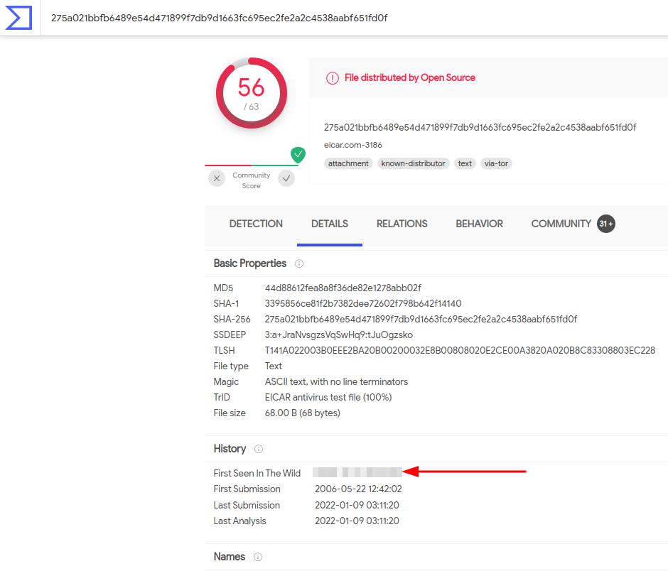
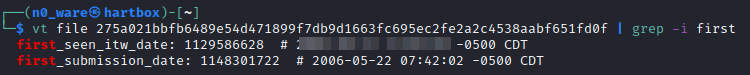
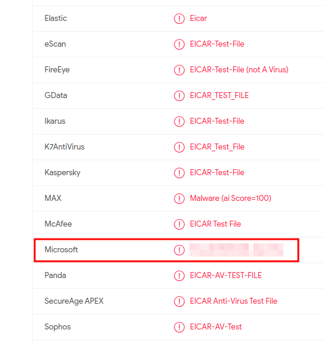
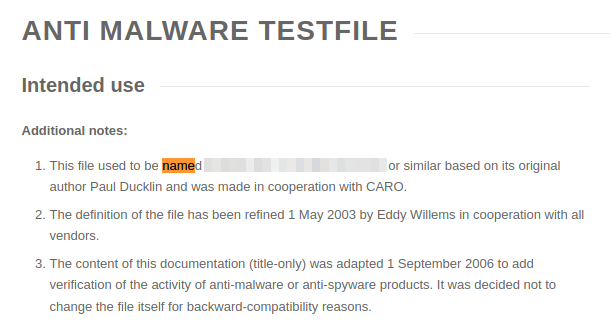
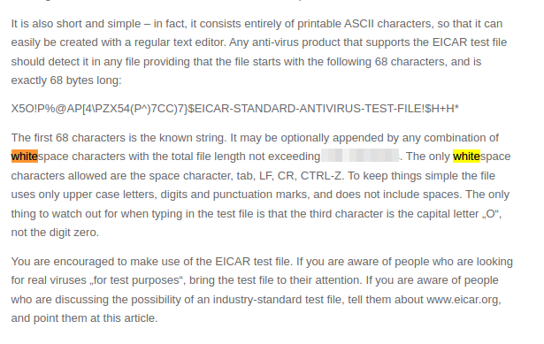

# TryHackMe - Advent of Cyber 2021 - Day 20
## What's the Worst That Could Happen (Blue Teaming)
> Edward Hartmann
> DATE

***<u>Refs/Links:</u>***
- [Advent of Cyber 2021 TOC](Advent%20of%20Cyber%20Table%20of%20Contents.md)  
-  Tags[^1]
-  Flag[^2]

[^1]: #ir #blue #malware
[^2]: *Question 1:* `X5O!P%@AP[4\PZX54(P^)7CC)7}$EICAR-STANDARD-ANTIVIRUS-TEST-FILE!$H+H*`  
					*Question 2:* `EICAR virus test files`  
					*Question 3:* `2005-10-17 22:03:48`  
					*Question 4:* `Virus:DOS/EICAR_Test_File`  
					*Question 5:* `ducklin.htm or ducklin-html.htm`  
					*Question 6:* `128`  


## TOC
- [Question 1-2](#Questions-1-2)
- [Question 3](#Question-3)
- [Question 4](#Question-4)
- [Question 5](#Question-5)
- [Question 6](#Question-6)


## Walkthrough

In this box, we are in a situation where McSkidy has been forwarded a payroll file that may be suspicious because we do not recognize the elf it belongs to. It is up to us to investigate the file, determine if it is safe, or if it is a piece of malware designed to harm TBFC. 

> This lab will take place on the attack box. 
### Questions-1-2
[Top](#TOC)

The first thing one should do when about to interact with an unknown file is identify its type using the Linux command `file`. The most basic is is simply `file <target>`. On the command line, navigate to `~/Desktop` and run the command below and note the output. 

```
file testfile
```



Some Google searching tells us this is a legitimate filetype, developed to test the responsiveness of antivirus systems without actually containing real malware. Read more [here](https://en.wikipedia.org/wiki/EICAR_test_file)

But, this could be incorrect. Let's see if we can find some identifiable data contained in the file with the [strings](../../../../Tools,%20Binaries,%20and%20Programs/CLI%20Utilities/strings.md) command. Run this on the file now. 

```
strings testfile
```



Copy this string in for your first flag. Remember the output from the first command? Enter that as your second flag. 

### Question-3
[Top](#TOC)

Next, we are asked to find the file "hash" value and submit it to [VirusTotal](https://www.virustotal.com/gui/home/upload) for analysis. We can assume they want the `md5` hash here as VT usually works with `md5`hashes. Run the command below to easily strip out everything but the hash value

```
md5sum testfile | cut -d " " -f1
```



Now, take this hash and use it on the Virus Total website to see if it returns any information. Select "Search" and paste in the hash' You will get a large number of results indicating it is malware, but if you did your research, you will know this is not the case. On the "Details" tab, search for the "History" section and find the date this was first seen in the wild. 



If you want to get fancy, you can use the `vt-cli` utility on your command line. This is a great tool to have around if you are in the practice of investigating malware, malicious websites or URLs, and the like. Instructions can be found [here](https://github.com/VirusTotal/vt-cli#installing-the-tool). 



Use this date as your next flag. 
### Question-4
[Top](#TOC)

The next question asks us to find the designation given by Microsoft. Head back to the "Detection" tab and scroll down to find it. 



### Question-5
[Top](#TOC)

Doing a little research is common on Malware. Head to the [link](https://www.eicar.org/?page_id=3950) provided and see if you can find the first two names this file once went by. 



### Question-6
[Top](#TOC)

Further down, we can find some information on this file's character size and max allowed limit. Read on and see if you can answer *Question 6*. 



***Congratulations on completing this box!***  

See you at the next one &mdash; [Advent of Cyber 3 Day 21](Day%2021%20-%20Advent%20of%20Cyber%202021.md)
</br>
</br>
</br>
</br>
</br>
</br>
</br>
</br>
</br>
</br>
</br>
</br>
</br>
</br>
</br>
</br>
</br>
</br>
</br>
</br>
</br>
</br>
</br>
</br>
</br>
</br>
</br>
</br>
</br>
</br>
</br>
</br>
</br>
</br>
</br>
</br>
</br>
</br>
</br>
</br>
</br>
</br>
</br>
</br>
</br>
</br>
</br>
</br>
</br>
</br>
</br>
</br>
</br>
</br>
</br>
</br>
</br>
</br>
</br>
</br>
</br>
</br>
</br>
