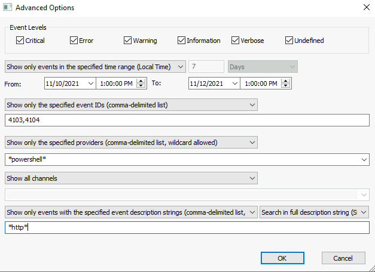
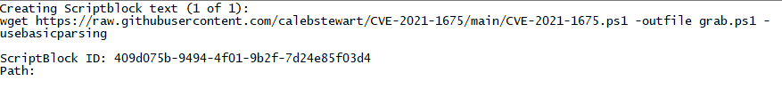
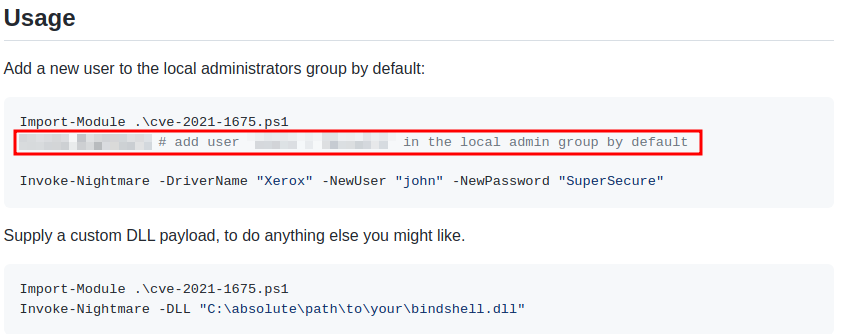
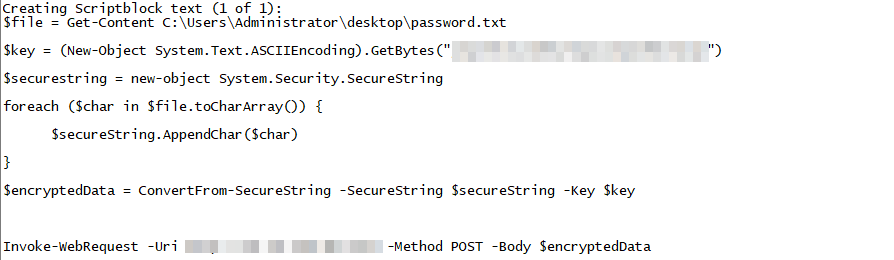
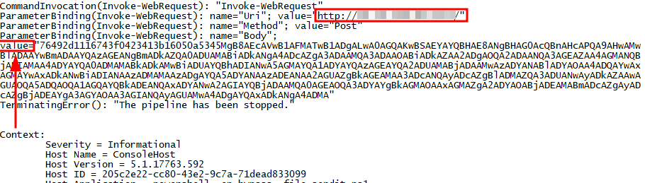
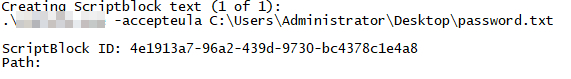
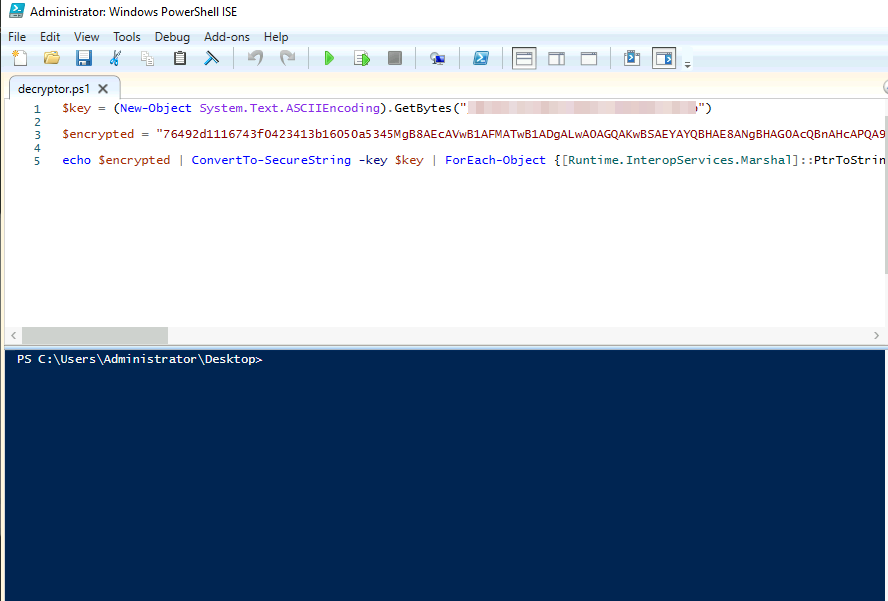

# TryHackMe - Advent of Cyber 2021 - Day 23
## PowershELlf Magic (Blue Teaming)
> Edward Hartmann
> January 9, 2022

***<u>Refs/Links:</u>***
- [Advent of Cyber 2021 TOC](Advent%20of%20Cyber%20Table%20of%20Contents.md)  
-  Tags[^1]
-  Flag[^2]

[^1]: #powershell #windowseventlog #dataexfil #encoding 
[^2]: *Question 1:* `Invoke-Nightmare`  
					*Question 2:* `adm1n`  
					*Question 3:* `10.10.148.96,4321`  
					*Question 4:* `j3pn50vkw21hhurbqmxjlpmo9doiukyb`  
					*Question 5:* `sdelete.exe`  
					*Question 6:* `11/11/2021 7:29:27 PM`  
					*Question 7:* `Mission Control: letitsnowletissnowletitsnow`  

## TOC
- [Question 1](#Question-1)
- [Question 2](#Question-2)
- [Questions 3-4](#Questions-3-4)
- [Questions 5-6](#Questions-5-6)
- [Question 6](#Question-6)
- [Question 7](#Question-7)

## Walkthrough
In this scenario, we are tasked with investigating [Windows Event Logs](../../../../Knowledge%20Base/Concepts/Windows/Windows%20Event%20Log.md) to discover where a missing password went for the Elf Dome Defense system. It is suspected that a recent [Phishing](../../../../Knowledge%20Base/Concepts/Phishing.md) attempt was successful. We need to find out what happened and what actions the actor took on the compromised PC by reviewing [PowerShell](../../../../Tools,%20Binaries,%20and%20Programs/Windows/PowerShell.md) event logs.  

> For this scenario, we are interested in event log IDs `4103` and `4014` from the provider `Microsoft-Windows-PowerShell`. This scenario will use the Attack Box. 

### Question-1
[Top](#TOC)

Fortunately, we know the time range the event took place during. Start by launching the event log tool per the instructions and opening the `Advanced Options` to start searching the logs. We know the events took place the week of *November 11th, 2021*. For the search parameters, match the image below. 



With this filter in place, we have only the logs showing for that date and related to PowerShell that contain the string `http` in their description. IF the logs are in descending order of `Event TIme`, you can see the story of events about this search. Investigate the first log. 



This log identifies a command, `wget`, being used to pull down the exploit known as [PrintNightmare LPE](https://github.com/calebstewart/CVE-2021-1675) from the creators GitHub repository. Quoting from the "readme" file on this page...

*"This PowerShell script performs local privilege escalation (LPE) with the PrintNightmare attack technique.""*

Reading further down under [Usage](https://github.com/calebstewart/CVE-2021-1675#usage), we see this is ran by first calling the PowerShell [cmdlet](../../../../Tools,%20Binaries,%20and%20Programs/Windows/PowerShell.md#command-lets)  `Invoke-Module` followed with a second command to create an admin user with a new password in the local admin group. The second command is the answer to the first question. 

### Question-2
[Top](#TOC)

If you have properly investigated the command, you'll be able to see the name of the default admin user created by default. User this for the second flag.  



### Questions-3-4
[Top](#TOC)

For us to find the IP and port that the actor called out to, we need to investigate some additional logs. We are aware the password went missing, so we can assume there was some sort of data exfiltration and deletion that took place. 

The fourth log contains a PowerShell script that details the process the actor went through to not only encrypt the `password.txt` file but exfiltrate it to a remote IP address. Find this log and locate the answers to *Question 3 and Question 4*



It is worth noting that all of the strings that start with `$` are variables declared in the script. Reading through this, we can see the attacker declared variables for a file (from which they got the content of `password.txt`), an encryption key (flag 4), a secure string, and the final encrypted data payload. Further down, they used the *cmdlet* `Invoke-WebRequest` to export the encrypted data via a `curl` [POST Request](../../../../Knowledge%20Base/Concepts/Web/POST%20Request.md) request to a remote IP on an obscure port (flag 3). 

### Questions-5-6
[Top](#TOC)

Furthering our investigation, we want to determine how the Elf's password file was deleted and see if we can potentially recover it. The next log file contains some interesting data to note for later. While the previous one contained the script, this log contains the data related to the *execution* of the script. Note the `value` field, this is the encrypted data, for which we, fortunately, have a key. It also has the value for flag 3. More on that later...



Saving for later...
```
76492d1116743f0423413b16050a5345MgB8AEcAVwB1AFMATwB1ADgALwA0AGQAKwBSAEYAYQBHAE8ANgBHAG0AcQBnAHcAPQA9AHwAMwBlADAAYwBmADAAYQAzAGEANgBmADkAZQA0ADUAMABiADkANgA4ADcAZgA3ADAAMQA3ADAAOABiADkAZAA2ADgAOQA2ADAANQA3AGEAZAA4AGMANQBjADIAMAA4ADYAYQA0ADMAMABkADkAMwBiADUAYQBhADIANwA5AGMAYQA1ADYAYQAzAGEAYQA2ADUAMABjADAAMwAzADYANABlADYAOAA4ADQAYwAxAGMAYwAxADkANwBiADIANAAzADMAMAAzADgAYQA5ADYANAAzADEANAA2AGUAZgBkAGEAMAA3ADcANQAyADcAZgBlADMAZQA3ADUANwAyADkAZAAwAGUAOQA5ADQAOQA1AGQAYQBkADEANQAxADYANwA2AGIAYQBjADAAMQA0AGEAOQA3ADYAYgBkAGMAOAAxAGMAZgA2ADYAOABjADEAMABmADcAZgAyADcAZgBjADEAYgA3AGYAOAA3AGIANQAyAGUAMwA4ADgAYQAxADkANgA4ADMA
```

We get a hint via another `wget` to the file used to delete the password in the second to last log. We see that a file named `Sdelete.zip` was downloaded and extracted. We don't, however, see any action on this file due to our current filter. Head back to the "advanced options" search and replace`*http*` with `*password.txt*` to show all the occurrences where this file was used. 

Only three log files are returned, and the final log records the command used to delete the file. 



Take this as the flag for *Question 5*, and record the timestamp of this log as the flag for *Question 6*

### Question-6
[Top](#TOC)

The last thing we are tasked with is finding the original contents of the file. This may seem impossible as it was deleted, but remember the encrypted `value` field we uncovered before? Fortunately, there is a `decryptor` PowerShell script on the desktop we can use for this. Grab that value and grab the encryption key we found for *Question 4* and open this file by right-clicking and choosing "Edit." This will open the PowerShell ISE, a sort of IDE for PowerShell scripts. Make your edits here. 



With the edits made, click the green right-arrow in the middle of the menu bar and view the output in the PowerShell terminal below. If all went well, it will output the decrypted value of `password.txt` for your final flag. 

***Congratulations on completing this box!***  

See you at the next one &mdash; [Advent of Cyber 3 Day X](AoC-2021_DayXX.md)
</br>
</br>
</br>
</br>
</br>
</br>
</br>
</br>
</br>
</br>
</br>
</br>
</br>
</br>
</br>
</br>
</br>
</br>
</br>
</br>
</br>
</br>
</br>
</br>
</br>
</br>
</br>
</br>
</br>
</br>
</br>
</br>
</br>
</br>
</br>
</br>
</br>
</br>
</br>
</br>
</br>
</br>
</br>
</br>
</br>
</br>
</br>
</br>
</br>
</br>
</br>
</br>
</br>
</br>
</br>
</br>
</br>
</br>
</br>
</br>
</br>
</br>
</br>
