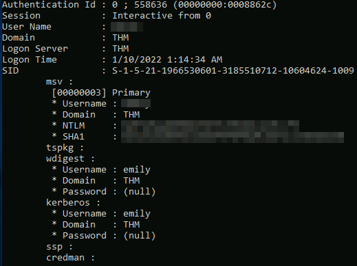
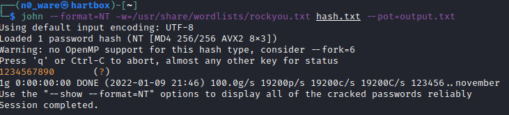
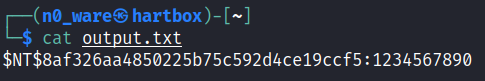

# TryHackMe - Advent of Cyber 2021 - Day 24 FINALE
## Learning from the Grinch (Post-Exploitation)
> Edward Hartmann
> January 9, 2022

***<u>Refs/Links:</u>***
- [Advent of Cyber 2021 TOC](Advent%20of%20Cyber%20Table%20of%20Contents.md)  
-  Tags[^1]
-  Flag[^2]

[^1]: #hashing  #cracking #lsass #windows #postexploitation #mimikatz
[^2]: *Question 1:* `emily`  
					*Question 2:* `8af326aa4850225b75c592d4ce19ccf5`  
					*Question 3:* `1234567890`  

## TOC
- [Questions 1-2](#Questions-1-2)
- [Question 2](#Question-2)
- [Question 3](#Question-3)

## Walkthrough
In this final box, we are exploring [post exploitation](../../../../Knowledge%20Base/Methodology/Post%20Exploitation.md) techniques using [mimikatz](../../../../Tools,%20Binaries,%20and%20Programs/Post-Exploitation/Password%20Harvetsing%20and%20Cracking/mimikatz.md) to pull credentials from the memory of [LSASS](../../../../Knowledge%20Base/Concepts/General/Authentication.md#LSASS). 

### Questions-1-2
[Top](#TOC)

Start by navigating to the directory of `mimiktaz` noted in the instructions and running the program with the command `mimikatz`. You should now have a command prompt proceeded with `#`. 

From here, we want to capture what credentials we can from memory using the `sekurlsa` module. Run the command:

```
sekurlsa::logonpasswords
```

Explore the list of returned passwords. While we do retrieve the `administrator` password, we are concerned with the other user. See if you can find her in the output. 



Once you find her, answer the first two questions. 

### Question-3
[Top](#TOC)

Now that you've located her `NTML` hash, we need to find the password this hash represents. For this, we need a password cracking tool such as [John the Ripper](../../../../Tools,%20Binaries,%20and%20Programs/Post-Exploitation/Password%20Harvetsing%20and%20Cracking/John%20the%20Ripper.md) the ripper. Using either your local virtual machine or the attack box, we are going to attempt to crack this password. 

Copy the `NTLM` hash and paste it to a text file with the command:

```
echo "NTML_HASH_HERE" > hash.txt
```

Now, we need to tell `john` how to crack this password. For this, we are going to use the `rockyou.txt` database available on all Kali systems in `/usr/share/wordlists/`. If you have not already, unzip it with `gunzip`. 

Once you have unzipped the wordlist and echoed the hash into `hash.txt`, run the command:

```
john --format=NT -w=/usr/share/wordlists/rockyou.txt hash.txt --pot=output.txt
```



The `output.txt` file is where we are directing the output, or cracked hashes. `cat` this file when you see the image above. You should have your hash, and the corresponding password, separated by a `:`. 



***Congratulations on completing this box and the entire Advent of Cyber Challenge!***  

I look forward to seeing you again in another write-up!
</br>
</br>
</br>
</br>
</br>
</br>
</br>
</br>
</br>
</br>
</br>
</br>
</br>
</br>
</br>
</br>
</br>
</br>
</br>
</br>
</br>
</br>
</br>
</br>
</br>
</br>
</br>
</br>
</br>
</br>
</br>
</br>
</br>
</br>
</br>
</br>
</br>
</br>
</br>
</br>
</br>
</br>
</br>
</br>
</br>
</br>
</br>
</br>
</br>
</br>
</br>
</br>
</br>
</br>
</br>
</br>
</br>
</br>
</br>
</br>
</br>
</br>
</br>
